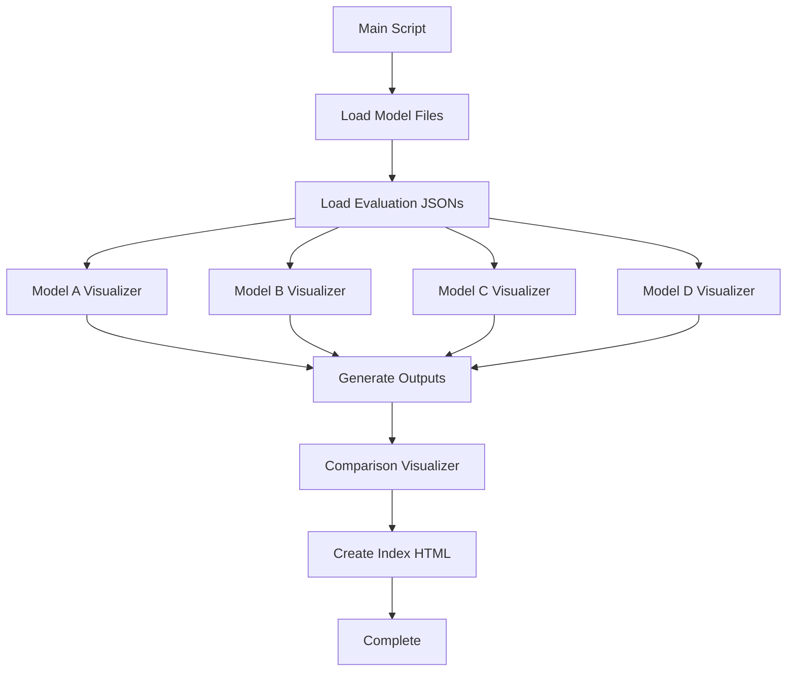

# Visualization Generator Design Document

## Overview

The Visualization Generator is a Python-based system that automatically creates publication-quality charts, graphs, and heatmaps from the FarmMe ML models (A, B, C, D) for use in academic documentation. The system will generate visualizations in a single execution, organizing outputs by model and visualization type.

## Architecture

### System Components

```
visualization-generator/
├── generate_all_visualizations.py    # Main orchestrator script
├── visualizers/
│   ├── __init__.py
│   ├── model_a_viz.py                # Model A specific visualizations
│   ├── model_b_viz.py                # Model B specific visualizations
│   ├── model_c_viz.py                # Model C specific visualizations
│   ├── model_d_viz.py                # Model D specific visualizations
│   ├── comparison_viz.py             # Cross-model comparisons
│   └── base_visualizer.py            # Shared visualization utilities
├── outputs/                          # Generated visualizations
│   ├── Model_A/
│   ├── Model_B/
│   ├── Model_C/
│   ├── Model_D/
│   ├── Comparisons/
│   └── index.html                    # Preview page
└── requirements.txt                  # Python dependencies
```

### Data Flow



## Components and Interfaces

### 1. Main Orchestrator (`generate_all_visualizations.py`)

**Purpose**: Coordinate all visualization generation and manage output directory structure

**Key Functions**:
```python
def main():
    """Main execution flow"""
    # 1. Setup output directories
    # 2. Load model data
    # 3. Generate model-specific visualizations
    # 4. Generate comparison visualizations
    # 5. Create index HTML
    # 6. Print summary

def setup_directories() -> Path:
    """Create timestamped output directory structure"""
    
def load_model_data() -> Dict[str, Any]:
    """Load all model files and evaluation JSONs"""
    
def generate_summary_report(outputs: List[Path]) -> None:
    """Create README with all generated files"""
```

### 2. Base Visualizer (`base_visualizer.py`)

**Purpose**: Provide shared utilities and consistent styling

**Key Functions**:
```python
class BaseVisualizer:
    def __init__(self, output_dir: Path, dpi: int = 300):
        self.output_dir = output_dir
        self.dpi = dpi
        self.style = self._setup_style()
    
    def _setup_style(self) -> Dict:
        """Configure matplotlib style for publication quality"""
        
    def save_figure(self, fig, filename: str) -> Path:
        """Save figure with consistent settings"""
        
    def create_heatmap(self, data: pd.DataFrame, title: str, 
                      filename: str, **kwargs) -> Path:
        """Generate correlation heatmap"""
        
    def create_bar_chart(self, data: pd.DataFrame, title: str,
                        filename: str, **kwargs) -> Path:
        """Generate bar chart"""
        
    def create_line_plot(self, data: pd.DataFrame, title: str,
                        filename: str, **kwargs) -> Path:
        """Generate line plot"""
```

**Styling Configuration**:
- Font: Arial or Sarabun (for Thai text support)
- DPI: 300 (publication quality)
- Color scheme: Consistent across all visualizations
- Figure size: 10x8 inches (default)

### 3. Model-Specific Visualizers

#### Model A Visualizer (`model_a_viz.py`)

**Visualizations**:
1. **Feature Correlation Heatmap**
   - Input: Training dataset features
   - Output: Correlation matrix with annotations
   
2. **Feature Importance Bar Chart**
   - Input: XGBoost feature importances
   - Output: Top 15 features ranked
   
3. **Performance Metrics Comparison**
   - Input: Evaluation JSON (R², RMSE, MAE)
   - Output: Bar chart comparing 3 algorithms
   
4. **Prediction vs Actual Scatter Plot**
   - Input: Test set predictions
   - Output: Scatter with regression line

```python
class ModelAVisualizer(BaseVisualizer):
    def generate_all(self, model_data: Dict) -> List[Path]:
        """Generate all Model A visualizations"""
        outputs = []
        outputs.append(self.correlation_heatmap(model_data))
        outputs.append(self.feature_importance(model_data))
        outputs.append(self.performance_metrics(model_data))
        outputs.append(self.prediction_scatter(model_data))
        return outputs
```

#### Model B Visualizer (`model_b_viz.py`)

**Visualizations**:
1. **Confusion Matrix Heatmap**
   - Input: Test predictions and true labels
   - Output: Normalized confusion matrix
   
2. **ROC Curve**
   - Input: Predicted probabilities and true labels
   - Output: ROC curve with AUC score
   
3. **Feature Importance**
   - Input: Logistic regression coefficients
   - Output: Top 15 features
   
4. **Classification Metrics Bar Chart**
   - Input: Evaluation JSON (F1, Precision, Recall)
   - Output: Grouped bar chart

```python
class ModelBVisualizer(BaseVisualizer):
    def generate_all(self, model_data: Dict) -> List[Path]:
        """Generate all Model B visualizations"""
        outputs = []
        outputs.append(self.confusion_matrix(model_data))
        outputs.append(self.roc_curve(model_data))
        outputs.append(self.feature_importance(model_data))
        outputs.append(self.classification_metrics(model_data))
        return outputs
```

#### Model C Visualizer (`model_c_viz.py`)

**Visualizations**:
1. **Price Forecast Time Series**
   - Input: Historical and predicted prices
   - Output: Line plot with confidence intervals
   
2. **Residual Plot**
   - Input: Prediction errors
   - Output: Residual distribution
   
3. **Feature Importance**
   - Input: XGBoost feature importances
   - Output: Top 15 features
   
4. **Performance Metrics**
   - Input: Evaluation JSON (R², RMSE, MAE, MAPE)
   - Output: Bar chart

```python
class ModelCVisualizer(BaseVisualizer):
    def generate_all(self, model_data: Dict) -> List[Path]:
        """Generate all Model C visualizations"""
        outputs = []
        outputs.append(self.price_forecast_plot(model_data))
        outputs.append(self.residual_plot(model_data))
        outputs.append(self.feature_importance(model_data))
        outputs.append(self.performance_metrics(model_data))
        return outputs
```

#### Model D Visualizer (`model_d_viz.py`)

**Visualizations**:
1. **Thompson Sampling Convergence**
   - Input: Bandit arm selection history
   - Output: Line plot showing arm selection over time
   
2. **Profit Distribution**
   - Input: Simulated profit outcomes
   - Output: Box plot or violin plot
   
3. **Decision Confidence**
   - Input: Posterior distributions
   - Output: Probability density plots

```python
class ModelDVisualizer(BaseVisualizer):
    def generate_all(self, model_data: Dict) -> List[Path]:
        """Generate all Model D visualizations"""
        outputs = []
        outputs.append(self.convergence_plot(model_data))
        outputs.append(self.profit_distribution(model_data))
        outputs.append(self.decision_confidence(model_data))
        return outputs
```

#### Comparison Visualizer (`comparison_viz.py`)

**Visualizations**:
1. **Cross-Model Performance Comparison**
   - Input: All model evaluation JSONs
   - Output: Grouped bar chart (normalized metrics)
   
2. **Model Complexity vs Performance**
   - Input: Model parameters and performance
   - Output: Scatter plot
   
3. **Pipeline Flow Diagram**
   - Input: Model relationships
   - Output: Flowchart (using matplotlib or saved as text for manual creation)

```python
class ComparisonVisualizer(BaseVisualizer):
    def generate_all(self, all_models_data: Dict) -> List[Path]:
        """Generate cross-model comparison visualizations"""
        outputs = []
        outputs.append(self.performance_comparison(all_models_data))
        outputs.append(self.complexity_vs_performance(all_models_data))
        return outputs
```

## Data Models

### Model Data Structure

```python
@dataclass
class ModelData:
    """Container for model data and metadata"""
    model_name: str                    # e.g., "Model A"
    model_file: Path                   # Path to .pkl file
    evaluation_json: Dict              # Loaded evaluation JSON
    training_data: Optional[pd.DataFrame]  # If available
    test_predictions: Optional[np.ndarray]  # If available
    feature_names: List[str]           # Feature column names
    
@dataclass
class VisualizationOutput:
    """Container for generated visualization metadata"""
    model_name: str
    viz_type: str                      # e.g., "heatmap", "bar_chart"
    file_path: Path
    title: str
    description: str
    timestamp: datetime
```

### Evaluation JSON Schema

Based on existing files, the evaluation JSONs follow this structure:

```json
{
  "model": "Model A - Crop Recommendation",
  "date": "2025-11-16",
  "status": "VERIFIED",
  "algorithms": {
    "xgboost": {
      "name": "XGBoost",
      "metrics": {
        "r2": 0.5234,
        "rmse": 2.1456,
        "mae": 1.6789
      }
    }
  }
}
```

## Error Handling

### Error Categories

1. **Missing Data Errors**
   - Model file not found
   - Evaluation JSON missing
   - Training data unavailable

**Handling**: Log warning, skip that specific visualization, continue with others

2. **Visualization Generation Errors**
   - Matplotlib rendering failure
   - Invalid data format
   - Memory issues

**Handling**: Log error with traceback, save error report, continue with next visualization

3. **File I/O Errors**
   - Cannot create output directory
   - Cannot save figure
   - Permission denied

**Handling**: Log critical error, attempt alternative path, fail gracefully

### Error Logging

```python
import logging

logging.basicConfig(
    level=logging.INFO,
    format='%(asctime)s - %(name)s - %(levelname)s - %(message)s',
    handlers=[
        logging.FileHandler('visualization_generation.log'),
        logging.StreamHandler()
    ]
)
```

## Testing Strategy

### Unit Tests

1. **Base Visualizer Tests**
   - Test style configuration
   - Test figure saving
   - Test each chart type with mock data

2. **Model Visualizer Tests**
   - Test each visualization function with sample data
   - Test error handling for missing data
   - Test output file creation

3. **Integration Tests**
   - Test full pipeline with real model files
   - Test directory structure creation
   - Test index HTML generation

### Test Data

Create mock data files:
- `test_model_a_evaluation.json`
- `test_training_data.csv`
- `test_predictions.npy`

### Manual Testing

1. Run script with actual model files
2. Verify all visualizations are generated
3. Check image quality (DPI, clarity)
4. Verify Thai text rendering (if applicable)
5. Test index HTML in browser

## Implementation Notes

### Dependencies

```txt
matplotlib>=3.7.0
seaborn>=0.12.0
pandas>=2.0.0
numpy>=1.24.0
scikit-learn>=1.3.0
Pillow>=10.0.0
```

### Thai Text Support

For Thai text in visualizations:
```python
import matplotlib.pyplot as plt
from matplotlib import font_manager

# Add Thai font
thai_font = font_manager.FontProperties(fname='path/to/Sarabun.ttf')
plt.rcParams['font.family'] = thai_font.get_name()
```

### Performance Considerations

- Generate visualizations in parallel where possible (using multiprocessing)
- Limit memory usage by processing one model at a time
- Use vector formats (SVG) for scalable graphics where appropriate
- Target completion time: < 5 minutes for all visualizations

### Output Organization

```
outputs/
├── 2025-11-19_143022/              # Timestamped run
│   ├── Model_A/
│   │   ├── correlation_heatmap.png
│   │   ├── feature_importance.png
│   │   ├── performance_metrics.png
│   │   └── prediction_scatter.png
│   ├── Model_B/
│   │   ├── confusion_matrix.png
│   │   ├── roc_curve.png
│   │   ├── feature_importance.png
│   │   └── classification_metrics.png
│   ├── Model_C/
│   │   ├── price_forecast.png
│   │   ├── residual_plot.png
│   │   ├── feature_importance.png
│   │   └── performance_metrics.png
│   ├── Model_D/
│   │   ├── convergence_plot.png
│   │   ├── profit_distribution.png
│   │   └── decision_confidence.png
│   ├── Comparisons/
│   │   ├── performance_comparison.png
│   │   └── complexity_vs_performance.png
│   ├── index.html                  # Preview page
│   ├── README.md                   # File listing
│   └── visualization_generation.log
```

## Design Decisions and Rationales

### Decision 1: Single Script Execution
**Rationale**: Researchers need to regenerate all visualizations quickly when models are updated. A single command is more convenient than running multiple scripts.

### Decision 2: Timestamped Output Directories
**Rationale**: Preserves historical visualizations for comparison and prevents accidental overwrites.

### Decision 3: Modular Visualizer Classes
**Rationale**: Each model has unique characteristics and metrics. Separate classes allow customization while sharing common utilities through inheritance.

### Decision 4: PNG Format (300 DPI)
**Rationale**: PNG provides lossless quality suitable for academic publications. 300 DPI meets most journal requirements. SVG can be added as an option for scalability.

### Decision 5: Continue on Error
**Rationale**: If one visualization fails, others should still be generated. Complete failure would be frustrating for users.

### Decision 6: Index HTML for Preview
**Rationale**: Allows quick visual inspection of all generated charts without opening individual files. Useful for quality checking before including in documents.
