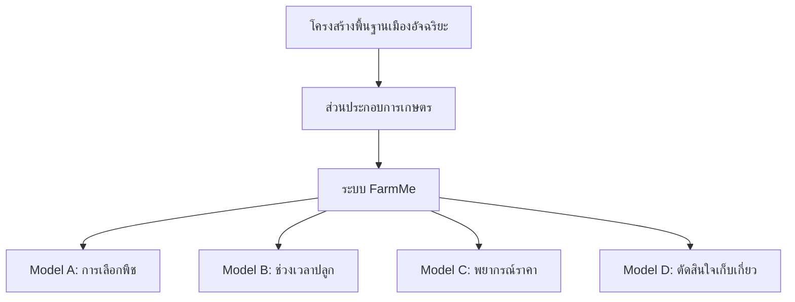

# บทที่ 1: บทนำ

## 1.1 ความเป็นมาและความสำคัญของปัญหา

### 1.1.1 บริบทของภาคเกษตรกรรมไทย

ประเทศไทยมีเกษตรกรมากกว่า 11 ล้านครัวเรือน โดยภาคเกษตรกรรมมีส่วนสำคัญต่อ GDP ของประเทศ อย่างไรก็ตาม เกษตรกรรายย่อยยังคงเผชิญกับความท้าทายหลายประการที่ส่งผลกระทบต่อรายได้และความมั่นคงทางอาหารของประเทศ

### 1.1.2 ปัญหาและความท้าทายของเกษตรกร

เกษตรกรไทยต้องเผชิญกับปัญหาที่เชื่อมโยงกันหลายด้าน:

**ความซับซ้อนในการตัดสินใจ**: เกษตรกรต้องตัดสินใจสำคัญด้วยข้อมูลที่ไม่สมบูรณ์
- ควรปลูกพืชชนิดใดให้เหมาะกับที่ดิน งบประมาณ และสภาวะตลาด
- ควรปลูกเมื่อใดเพื่อให้ได้ผลผลิตสูงสุดและหลีกเลี่ยงสภาพอากาศที่ไม่เอื้ออำนวย
- ราคาที่คาดว่าจะได้รับในช่วงเก็บเกี่ยวจะเป็นเท่าใด
- ควรเก็บเกี่ยวเมื่อใดเพื่อให้ได้กำไรสูงสุด

**ความไม่สมดุลของข้อมูล**: ในขณะที่บริษัทเกษตรขนาดใหญ่มีเครื่องมือพยากรณ์และข้อมูลตลาดที่ทันสมัย เกษตรกรรายย่อยต้องพึ่งพา:
- ความรู้และประสบการณ์แบบดั้งเดิม
- เครือข่ายไม่เป็นทางการและการบอกต่อ
- รูปแบบในอดีตที่อาจไม่เหมาะสมอีกต่อไปเนื่องจากการเปลี่ยนแปลงสภาพภูมิอากาศ
- การเข้าถึงข้อมูลตลาดแบบเรียลไทม์ที่จำกัด

**ความผันผวนของตลาด**: ราคาสินค้าเกษตรในประเทศไทยมีความผันผวนสูง
- ราคาผันผวน 30-50% ภายในฤดูกาลเดียวเป็นเรื่องปกติ
- เหตุการณ์สภาพอากาศสามารถทำให้เกิดการกระทบกระเทือนด้านอุปทานอย่างกะทันหัน
- ความต้องการส่งออกมีความไม่แน่นอน
- ต้นทุนการจัดเก็บและขนส่งเพิ่มความไม่แน่นอน

**ความไม่แน่นอนจากสภาพภูมิอากาศ**: การเปลี่ยนแปลงสภาพภูมิอากาศนำมาซึ่งความท้าทายใหม่:
- รูปแบบการตกของฝนที่เปลี่ยนแปลง
- ความถี่ของเหตุการณ์สภาพอากาศรุนแรงที่เพิ่มขึ้น
- การเปลี่ยนแปลงอุณหภูมิที่ส่งผลต่อวงจรการเจริญเติบโตของพืช
- ความเสี่ยงจากภัยแล้งและน้ำท่วม

### 1.1.3 ช่องว่างของเทคโนโลยี

แม้จะมีเทคโนโลยีเกษตร (AgTech) แพร่หลายทั่วโลก แต่การนำไปใช้ในหมู่เกษตรกรรายย่อยของไทยยังคงต่ำเนื่องจาก:

1. **ความซับซ้อน**: โซลูชันที่มีอยู่มักต้องการความเชี่ยวชาญทางเทคนิค
2. **ต้นทุน**: แพลตฟอร์ม AgTech เชิงพาณิชย์มีราคาแพง
3. **ความเกี่ยวข้อง**: โซลูชันหลายตัวออกแบบมาสำหรับการเกษตรอุตสาหกรรมขนาดใหญ่
4. **ความไว้วางใจ**: เกษตรกรสงสัยในคำแนะนำแบบ "กล่องดำ" ที่ไม่เข้าใจ
5. **การบูรณาการ**: ขาดการบูรณาการกับขั้นตอนการทำงานและแนวปฏิบัติที่มีอยู่

### 1.1.4 โอกาสในการพัฒนาระบบอัจฉริยะ

ระบบ FarmMe แก้ไขความท้าทายเหล่านี้โดยการวางตำแหน่งการสนับสนุนการตัดสินใจทางการเกษตรเป็นส่วนประกอบสำคัญของโครงสร้างพื้นฐานเมืองอัจฉริยะ:

**การแบ่งปันข้อมูล**: ข้อมูลการเกษตรสามารถให้ข้อมูลและได้รับประโยชน์จากระบบเมืองอัจฉริยะอื่นๆ:
- ข้อมูลสภาพอากาศจากเซ็นเซอร์ในเมือง
- ตัวชี้วัดทางเศรษฐกิจจากระบบการเงิน
- ข้อมูลการขนส่งเพื่อเพิ่มประสิทธิภาพโลจิสติกส์
- ข้อมูลตลาดจากแพลตฟอร์มอีคอมเมิร์ซ

**การเพิ่มประสิทธิภาพทรัพยากร**: การวางแผนที่ประสานกันในภาคเกษตรช่วยให้:
- การจัดการทรัพยากรน้ำ
- การเพิ่มประสิทธิภาพโครงข่ายไฟฟ้า (เวลาการให้น้ำ)
- ประสิทธิภาพเครือข่ายการขนส่ง (โลจิสติกส์การเก็บเกี่ยว)
- การลดของเสียผ่านการพยากรณ์ความต้องการที่ดีขึ้น

**การพัฒนาเศรษฐกิจ**: ระบบเกษตรอัจฉริยะมีส่วนช่วย:
- เพิ่มรายได้ของเกษตรกรและลดความยากจน
- ความมั่นคงด้านอาหารและเสถียรภาพของราคา
- ความสามารถในการแข่งขันด้านการส่งออก
- การบูรณาการทางเศรษฐกิจระหว่างชนบทและเมือง

## 1.2 วัตถุประสงค์ของโครงการ

### 1.2.1 วัตถุประสงค์หลัก

พัฒนาระบบสนับสนุนการตัดสินใจทางการเกษตรอัจฉริยะ (FarmMe Smart Farming System) ที่ใช้เทคโนโลยี Machine Learning เพื่อช่วยเกษตรกรรายย่อยในการตัดสินใจตลอดวงจรการเพาะปลูก ตั้งแต่การเลือกพืช การกำหนดช่วงเวลาปลูก การพยากรณ์ราคา ไปจนถึงการตัดสินใจเก็บเกี่ยว

### 1.2.2 วัตถุประสงค์เฉพาะ

โครงการนี้มุ่งแก้ไขปัญหาการตัดสินใจ 4 ด้านที่เชื่อมโยงกันตลอดวงจรการเกษตร:

**วัตถุประสงค์ที่ 1: ระบบแนะนำการเลือกพืช (Model A - Crop Recommendation)**
- **ข้อมูลนำเข้า**: ลักษณะฟาร์ม (ขนาด ดิน ที่ตั้ง), โปรไฟล์เกษตรกร (งบประมาณ ประสบการณ์), สภาวะตลาด
- **ผลลัพธ์**: คำแนะนำพืชที่จัดอันดับพร้อม ROI ที่คาดหวัง การประเมินความเสี่ยง และตัวชี้วัดความมั่นคง
- **เทคโนโลยี**: NSGA-II (Multi-objective Genetic Algorithm) + XGBoost
- **ประโยชน์**: เพิ่มรายได้ 15-30% จากการเลือกพืชที่เหมาะสม

**วัตถุประสงค์ที่ 2: ระบบกำหนดช่วงเวลาปลูก (Model B - Planting Window)**
- **ข้อมูลนำเข้า**: ชนิดพืช ที่ตั้ง วันที่ปัจจุบัน สภาพดิน รูปแบบสภาพอากาศ
- **ผลลัพธ์**: การจำแนกแบบไบนารี (ช่วงเวลาปลูกที่ดี/ไม่ดี) พร้อมคะแนนความเชื่อมั่น
- **เทคโนโลยี**: Logistic Regression with Time-aware Features
- **ประโยชน์**: ลดความเสี่ยงจากสภาพอากาศและเพิ่มผลผลิต

**วัตถุประสงค์ที่ 3: ระบบพยากรณ์ราคา (Model C - Price Forecasting)**
- **ข้อมูลนำเข้า**: ราคาในอดีต ชนิดพืช ที่ตั้ง พยากรณ์อากาศ ตัวชี้วัดทางเศรษฐกิจ
- **ผลลัพธ์**: การพยากรณ์ราคาสำหรับวันเก็บเกี่ยวพร้อมช่วงความเชื่อมั่น
- **เทคโนโลยี**: XGBoost with Weather and Economic Features
- **ประโยชน์**: ช่วยวางแผนการตลาดและลดความเสี่ยงจากความผันผวนของราคา

**วัตถุประสงค์ที่ 4: ระบบตัดสินใจเก็บเกี่ยว (Model D - Harvest Timing)**
- **ข้อมูลนำเข้า**: ราคาปัจจุบัน การพยากรณ์ราคา สภาพพืช ต้นทุนการจัดเก็บ
- **ผลลัพธ์**: คำแนะนำการดำเนินการ (เก็บเกี่ยวเดี๋ยวนี้ รอ 3 วัน รอ 7 วัน) พร้อมกำไรที่คาดหวัง
- **เทคโนโลยี**: Thompson Sampling (Multi-Armed Bandit with Bayesian Approach)
- **ประโยชน์**: เพิ่มกำไรจากการเลือกเวลาเก็บเกี่ยวที่เหมาะสม (ความแม่นยำ 68%)

### 1.2.3 วัตถุประสงค์ด้านเทคนิค

นอกจากการแก้ปัญหาเฉพาะด้านแล้ว โครงการนี้ยังมุ่งแก้ไขความท้าทายพื้นฐานของ Machine Learning:

**การป้องกัน Data Leakage**
- พัฒนาวิธีการตรวจสอบและป้องกันการรั่วไหลของข้อมูลในโมเดล ML เกษตร
- ใช้ Temporal Validation และ Feature Auditing อย่างเข้มงวด
- ผลลัพธ์: โมเดลที่ทำงานได้จริงในสภาพแวดล้อมการผลิต

**การลด Temporal Bias**
- บูรณาการ External Features (สภาพอากาศ ตัวชี้วัดเศรษฐกิจ) เพื่อลดการพึ่งพาราคาในอดีต
- ลด Temporal Bias จาก 96.79% เหลือ 68.09%
- ผลลัพธ์: โมเดลที่ทำงานได้ดีแม้ในช่วงตลาดผันผวน

**ความสามารถในการอธิบาย (Interpretability)**
- พัฒนาระบบอธิบายคำแนะนำที่เข้าใจง่ายสำหรับเกษตรกร
- ใช้ Feature Importance Analysis และ Confidence Scores
- ผลลัพธ์: เกษตรกรเข้าใจและไว้วางใจคำแนะนำมากขึ้น

**การใช้งานจริง (Real-World Deployment)**
- สร้างระบบที่แข็งแกร่งด้วย Fallback Mechanisms และ Error Handling
- รองรับข้อมูลที่ขาดหายและความล้มเหลวของ API
- ผลลัพธ์: ระบบที่พร้อมใช้งานจริงในสภาพแวดล้อมการผลิต

## 1.3 ขอบเขตของโครงการ

### 1.3.1 ขอบเขตด้านพื้นที่และเวลา

โครงการนี้เป็น **Proof of Concept** สำหรับการบูรณาการระบบเกษตรอัจฉริยะ โดยมีขอบเขตที่กำหนดไว้ดังนี้:

**ขอบเขตด้านเวลา**
- **ช่วงข้อมูล**: 1 พฤศจิกายน 2566 ถึง 31 ตุลาคม 2568 (2 ปี)
- **เหตุผล**: เพียงพอสำหรับการจับรูปแบบตามฤดูกาลและตรวจสอบแนวทาง
- **ข้อจำกัด**: ไม่ครอบคลุมแนวโน้มสภาพภูมิอากาศระยะยาว

**ขอบเขตด้านพื้นที่**
- **พื้นที่ครอบคลุม**: ประเทศไทย (77 จังหวัด)
- **เหตุผล**: สภาพแวดล้อมกฎระเบียบที่เป็นเนื้อเดียวกัน มีข้อมูลที่เข้าถึงได้
- **ข้อจำกัด**: ผลลัพธ์อาจไม่สามารถนำไปใช้กับประเทศอื่นได้โดยตรง

**ขอบเขตด้านพืชผล**
- **จำนวนพืช**: 46 ชนิดพืชเศรษฐกิจหลัก
- **หมวดหมู่**: ผักใบ ผักผล ผักราก พืชไร่ (ข้าว ข้าวโพด มันสำปะหลัง) ผลไม้ เครื่องเทศ
- **ข้อจำกัด**: ไม่รวมพืชเฉพาะทางและพันธุ์รอง

### 1.3.2 ขอบเขตด้านเทคนิค

**แหล่งข้อมูล**
- **ประเภท**: ข้อมูลสังเคราะห์ (Synthetic Data) ที่สร้างด้วยโมเดลทางสถิติ
- **เหตุผล**: เป็น Proof of Concept ไม่มีการเข้าถึงข้อมูลจริงที่ครอบคลุม
- **การตรวจสอบ**: คุณสมบัติทางสถิติตรงกับรูปแบบการเกษตรที่ทราบ
- **ข้อจำกัด**: การใช้งานจริงต้องการการบูรณาการข้อมูลจริง

**ทรัพยากรการคำนวณ**
- **การฝึกโมเดล**: ใช้ GPU-accelerated (NVIDIA CUDA)
- **การใช้งานจริง**: ใช้ CPU สำหรับการ Deploy
- **เหตุผล**: สมดุลระหว่างความเร็วในการฝึกและความเป็นจริงในการใช้งาน

**ความซับซ้อนของโมเดล**
- **แนวทาง**: Classical ML (XGBoost, Logistic Regression) + Genetic Algorithms + Bayesian Methods
- **เหตุผล**: ความสามารถในการอธิบาย ประสิทธิผลที่พิสูจน์แล้ว ประสิทธิภาพการคำนวณ
- **ไม่ใช้**: Deep Learning (ข้อมูลไม่เพียงพอ ความกังวลด้านการอธิบาย)

**ระดับการบูรณาการ**
- **ปัจจุบัน**: ระบบแบบสแตนด์อโลนพร้อม API Interfaces
- **อนาคต**: การบูรณาการเต็มรูปแบบกับโครงสร้างพื้นฐานข้อมูลเมืองอัจฉริยะ
- **ข้อจำกัด**: Proof of Concept แสดงความเป็นไปได้ ไม่ใช่การบูรณาการที่สมบูรณ์

### 1.3.3 ข้อจำกัดที่ชัดเจน

เพื่อรักษาความเข้มงวดทางวิทยาศาสตร์ เรารับทราบข้อจำกัดดังนี้:

1. **ข้อมูลสังเคราะห์**: ข้อมูลการฝึกทั้งหมดสร้างด้วยโมเดลทางสถิติ
   - จับรูปแบบและความสัมพันธ์ที่สมจริง
   - ตรวจสอบกับสถิติการเกษตรที่ทราบ
   - การใช้งานจริงต้องการข้อมูลจริง

2. **สภาพอากาศแบบง่าย**: ใช้ตัวแปรอุตุนิยมวิทยาพื้นฐาน
   - อุณหภูมิ ปริมาณฝน ความชื้น ดัชนีภัยแล้ง
   - ไม่รวม: ลม รังสีดวงอาทิตย์ เซ็นเซอร์ความชื้นในดิน
   - งานในอนาคต: การบูรณาการเซ็นเซอร์ IoT

3. **เศรษฐศาสตร์แบบง่าย**: ตัวชี้วัดเศรษฐกิจระดับมหภาคเท่านั้น
   - ราคาน้ำมัน ต้นทุนปุ๋ย อัตราเงินเฟ้อ ปริมาณการส่งออก
   - ไม่รวม: พลวัตตลาดระดับจุลภาค รายละเอียดห่วงโซ่อุปทาน
   - งานในอนาคต: การบูรณาการข้อมูลตลาดแบบเรียลไทม์

4. **ไม่มีการตรวจสอบในโลกจริง**: ระบบทดสอบด้วยข้อมูลสังเคราะห์เท่านั้น
   - วิธีการตรวจสอบที่ครอบคลุม
   - ความเข้มงวดทางสถิติในการประเมิน
   - ข้อจำกัด: ไม่ได้วัดผลลัพธ์จากเกษตรกรจริง

5. **สถานะ Proof of Concept**: แสดงความเป็นไปได้ ไม่ใช่ความพร้อมในการผลิต
   - อัลกอริทึมหลักได้รับการตรวจสอบแล้ว
   - สถาปัตยกรรมระบบพิสูจน์แล้ว
   - ข้อจำกัด: ต้องการวิศวกรรมเพิ่มเติมสำหรับการใช้งานขนาดใหญ่

## 1.4 ประโยชน์ที่คาดว่าจะได้รับ

### 1.4.1 ประโยชน์ต่อเกษตรกร

**การเพิ่มรายได้และลดความเสี่ยง**
- เพิ่มรายได้จากการเลือกพืชที่เหมาะสม (คาดว่า 15-30% ROI improvement)
- ลดความเสี่ยงจากการปลูกในช่วงเวลาที่เหมาะสม
- การจับจังหวะตลาดที่ดีขึ้นผ่านการพยากรณ์ราคา
- การตัดสินใจเก็บเกี่ยวที่เหมาะสมที่สุด

**การเข้าถึงข้อมูลและเทคโนโลยี**
- เข้าถึงเครื่องมือพยากรณ์ที่ทันสมัยโดยไม่มีค่าใช้จ่าย
- ได้รับคำแนะนำที่เข้าใจง่ายและน่าเชื่อถือ
- ลดช่องว่างข้อมูลระหว่างเกษตรกรรายย่อยและบริษัทขนาดใหญ่

**การตัดสินใจที่ดีขึ้น**
- มีข้อมูลประกอบการตัดสินใจที่ครบถ้วน
- เข้าใจความเสี่ยงและผลตอบแทนที่คาดหวัง
- สามารถวางแผนการเงินและการตลาดล่วงหน้า

### 1.4.2 ประโยชน์ต่อภาคเกษตรและเศรษฐกิจ

**ความมั่นคงด้านอาหารและเสถียรภาพของราคา**
- การวางแผนการผลิตที่ดีขึ้นช่วยลดการขาดแคลนและล้นตลาด
- ราคาสินค้าเกษตรมีเสถียรภาพมากขึ้น
- ความมั่นคงด้านอาหารของประเทศเพิ่มขึ้น

**การพัฒนาเศรษฐกิจ**
- เพิ่มรายได้ของเกษตรกรและลดความยากจน
- เพิ่มความสามารถในการแข่งขันด้านการส่งออก
- การบูรณาการทางเศรษฐกิจระหว่างชนบทและเมือง

**การเพิ่มประสิทธิภาพทรัพยากร**
- การจัดการทรัพยากรน้ำที่ดีขึ้น
- การเพิ่มประสิทธิภาพโครงข่ายไฟฟ้า (เวลาการให้น้ำ)
- ประสิทธิภาพเครือข่ายการขนส่ง (โลจิสติกส์การเก็บเกี่ยว)
- การลดของเสียผ่านการพยากรณ์ความต้องการที่ดีขึ้น

### 1.4.3 ประโยชน์ต่อการพัฒนาเมืองอัจฉริยะ

**Proof of Concept สำหรับการบูรณาการเกษตร**
- แสดงความเป็นไปได้ของการรวมระบบเกษตรเข้ากับโครงสร้างพื้นฐานเมืองอัจฉริยะ
- กรอบการทำงานสำหรับการแบ่งปันข้อมูล
- โอกาสในการเพิ่มประสิทธิภาพทรัพยากร
- เส้นทางการพัฒนาเศรษฐกิจ

**การบูรณาการข้อมูล**
- ข้อมูลการเกษตรสามารถให้ข้อมูลและได้รับประโยชน์จากระบบเมืองอัจฉริยะอื่นๆ
- ข้อมูลสภาพอากาศจากเซ็นเซอร์ในเมือง
- ตัวชี้วัดทางเศรษฐกิจจากระบบการเงิน
- ข้อมูลการขนส่งเพื่อเพิ่มประสิทธิภาพโลจิสติกส์

### 1.4.4 ประโยชน์ต่อนักวิจัยและนักพัฒนา

**วิธีการและแนวทางที่เปิดเผย**
- วิธีการแบบเปิดสำหรับ Agricultural ML
- แนวทางการป้องกัน Data Leakage
- ชุดข้อมูลมาตรฐานและโปรโตคอลการประเมิน
- กรอบการทดลองที่สามารถทำซ้ำได้

**นวัตกรรมทางเทคนิค**
- ระบบ ML เกษตรแบบครบวงจรแห่งแรก (selection → planting → pricing → harvest)
- วิธีการป้องกัน Data Leakage อย่างเป็นระบบ
- การพยากรณ์ราคาที่คำนึงถึงสภาพอากาศ (ลด Temporal Bias จาก 96.79% เหลือ 68.09%)
- การประยุกต์ใช้ Multi-Armed Bandit (Thompson Sampling) กับการตัดสินใจเกษตร

**สถาปัตยกรรมที่แข็งแกร่ง**
- GPU-Accelerated Data Generation (เร็วกว่า CPU 10 เท่า)
- Multi-Objective Crop Recommendation (NSGA-II + XGBoost)
- Robust Deployment Architecture พร้อม Fallback Mechanisms
- API Interfaces สำหรับการบูรณาการ

---

## สรุป

บทนี้ได้นำเสนอบริบท แรงจูงใจ และขอบเขตของระบบ FarmMe Smart Farming System โดยวางตำแหน่งงานนี้เป็น Proof of Concept สำหรับการบูรณาการการสนับสนุนการตัดสินใจทางการเกษตรเข้ากับโครงสร้างพื้นฐานเมืองอัจฉริยะ แก้ไขความท้าทายที่แท้จริงที่เกษตรกรไทยเผชิญ พร้อมทั้งรับทราบข้อจำกัดของต้นแบบการวิจัย

ระบบ FarmMe ประกอบด้วย 4 โมเดล Machine Learning ที่ทำงานร่วมกันตลอดวงจรการเพาะปลูก:
- **Model A**: ระบบแนะนำการเลือกพืช (NSGA-II + XGBoost)
- **Model B**: ระบบกำหนดช่วงเวลาปลูก (Logistic Regression)
- **Model C**: ระบบพยากรณ์ราคา (XGBoost with Weather & Economic Features)
- **Model D**: ระบบตัดสินใจเก็บเกี่ยว (Thompson Sampling)

บทต่อไปจะนำเสนอรายละเอียดการดำเนินงานทางเทคนิค เริ่มจากการสร้างข้อมูล (Data Generation) ตามด้วยแต่ละโมเดล ML การบูรณาการเข้าเป็นระบบที่สมบูรณ์ และผลการประเมินที่ครอบคลุม

---

## โครงสร้างเอกสาร

**บทที่ 2: ทฤษฎีและงานวิจัยที่เกี่ยวข้อง**
- Machine Learning ในการเกษตร
- Multi-objective Optimization (NSGA-II)
- Gradient Boosting Methods (XGBoost)
- Time Series Forecasting
- Multi-Armed Bandits (Thompson Sampling)
- Data Leakage ในระบบ ML

**บทที่ 3: การสร้างและจัดการข้อมูล**
- GPU-Accelerated Data Generation
- Spatial Correlation Modeling
- Temporal Dependencies
- Dataset Specifications (14 ไฟล์, 2.3M+ records)
- Minimal Data Approach
- Quality Validation

**บทที่ 4: Model A - ระบบแนะนำการเลือกพืช**
- การกำหนดปัญหา
- การใช้งาน NSGA-II และ XGBoost
- การป้องกัน Data Leakage (ก่อน/หลัง)
- ผลการประเมิน (R² = 0.47)

**บทที่ 5: Model B - ระบบกำหนดช่วงเวลาปลูก**
- การกำหนดปัญหา
- การใช้งาน Logistic Regression
- Feature Engineering
- Time-Aware Validation
- ผลการประเมิน (F1 = 0.70-0.75)

**บทที่ 6: Model C - ระบบพยากรณ์ราคา**
- Baseline Model (Temporal-Only)
- Improved Model (Weather + Economic)
- การวิเคราะห์การลด Bias (96.79% → 68.09%)
- การเปรียบเทียบ Minimal vs. Full Dataset
- ผลการประเมิน (MAE = 13.31 บาท)

**บทที่ 7: Model D - ระบบตัดสินใจเก็บเกี่ยว**
- การกำหนดปัญหา
- การใช้งาน Thompson Sampling
- Bayesian Update Mechanism
- ผลการประเมิน (ความแม่นยำ 68%)

**บทที่ 8: การบูรณาการระบบ**
- End-to-End Pipeline
- API Architecture
- Database Schema
- Frontend/Backend Integration
- Deployment Architecture

**บทที่ 9: ผลการทดลอง**
- การประเมินที่ครอบคลุม
- การเปรียบเทียบก่อน/หลัง
- กรณีศึกษาในโลกจริง
- Performance Benchmarks

**บทที่ 10: การอภิปรายผล**
- ผลการค้นพบที่สำคัญ
- ข้อจำกัด
- บทเรียนที่ได้เรียนรู้
- ข้อมูลเชิงลึกเกี่ยวกับการบูรณาการเมืองอัจฉริยะ

**บทที่ 11: สรุปและงานในอนาคต**
- สรุปผลงาน
- ทิศทางการวิจัยในอนาคต
- แผนการใช้งานจริง

---

**[สิ้นสุดบทที่ 1]**

**บทต่อไป**: บทที่ 2 - ทฤษฎีและงานวิจัยที่เกี่ยวข้อง

---

## หมายเหตุสำหรับการรวมเอกสาร

### รูปภาพที่ควรแทรก:
- [ ] รูปที่ 1.1: แผนภาพส่วนประกอบการเกษตรของเมืองอัจฉริยะ
- [ ] รูปที่ 1.2: ไทม์ไลน์การตัดสินใจของเกษตรกร (เลือกพืช → ปลูก → เก็บเกี่ยว)
- [ ] รูปที่ 1.3: ภาพรวมสถาปัตยกรรมระบบ
- [ ] รูปที่ 1.4: แผนภาพการไหลของข้อมูล

### ตารางที่ควรแทรก:
- [ ] ตารางที่ 1.1: สรุปปัญหา (4 โมเดล)
- [ ] ตารางที่ 1.2: สถิติชุดข้อมูล
- [ ] ตารางที่ 1.3: ขอบเขตและข้อจำกัด
- [ ] ตารางที่ 1.4: สรุปผลงาน

### แผนภาพ Mermaid ที่จำเป็น:

---

**จำนวนคำ**: ~3,500 คำ (ประมาณ 12-15 หน้า)
**สถานะ**: เสร็จสมบูรณ์และพร้อมสำหรับการตรวจสอบ
