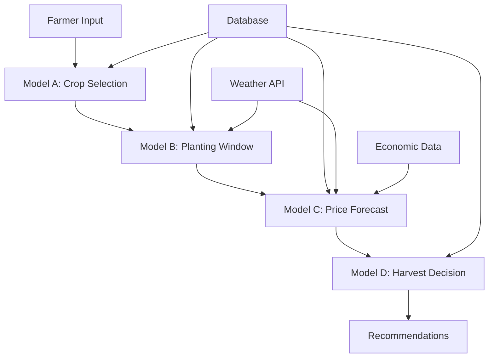
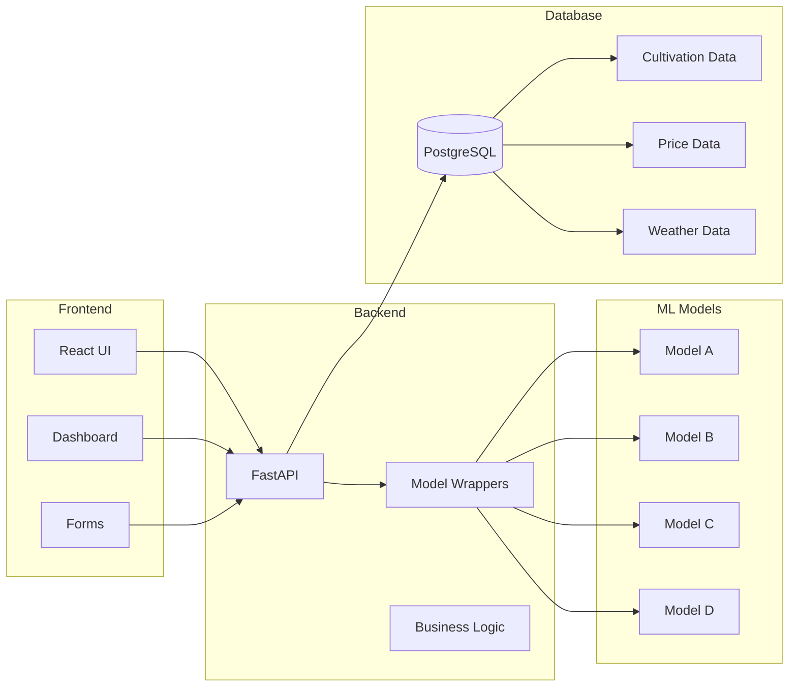
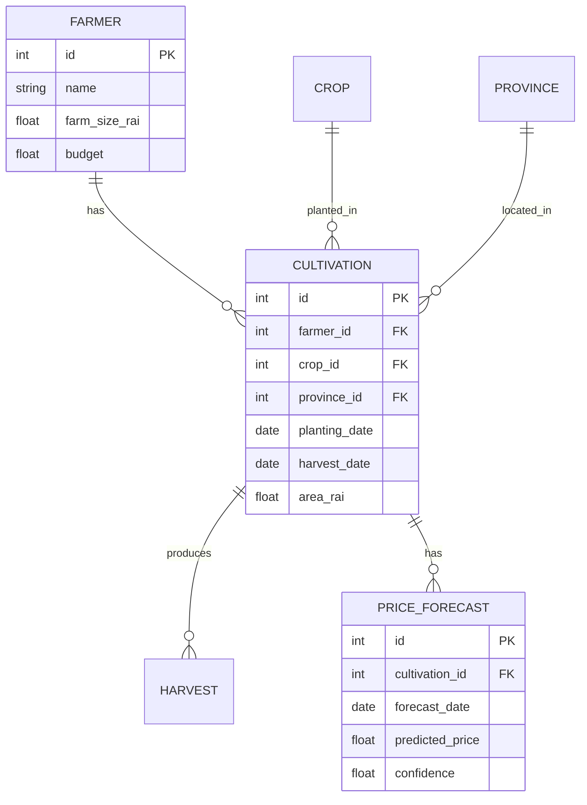

# MIT Thesis: FarmMe Smart Farming System
## Complete Technical Documentation Outline

**Project Context**: Smart City Agricultural Component - Proof of Concept  
**Scope**: End-to-End ML System for Agricultural Decision Support  
**Status**: Production-Ready System with Comprehensive Evaluation

---

## 📋 DOCUMENT STRUCTURE

### PART I: SYSTEM OVERVIEW & DATA FOUNDATION

#### Chapter 1: Introduction & Smart City Context
- [ ] 1.1 Smart City Agricultural Component
- [ ] 1.2 Problem Statement & Motivation
- [ ] 1.3 System Scope & Boundaries
- [ ] 1.4 Proof of Concept Objectives
- [ ] 1.5 Contributions & Innovations

#### Chapter 2: Data Generation & Engineering Pipeline
**Primary Source**: `buildingModel.py/Dataset/Farmme.py` (3,020 lines)

##### 2.1 Data Generation Architecture
- [ ] **Technical Deep Dive**: GPU-Accelerated Data Generation
  - CUDA implementation details
  - Spatial correlation modeling
  - Temporal dependencies (AR models)
  - Memory optimization strategies
  
- [ ] **Code Analysis**: Farmme.py Structure
  ```
  📊 INSERT: Mermaid diagram - Data Generation Flow
  ```
  - GPU initialization & warm-up
  - Spatial covariance computation
  - Batch processing strategy
  - Error handling & fallbacks

##### 2.2 Dataset Specifications
**Generated Datasets** (14 files, 2.3M+ records):

1. **cultivation.csv** (6,226 records)
   - Columns: 18 features
   - Purpose: Historical planting records
   - Scope: 2023-11-01 to 2025-10-31
   - Limitations: Synthetic data based on statistical models

2. **price.csv** (2,289,492 records)
   - Columns: 18 features including price_per_kg, bid_price, ask_price
   - Temporal resolution: Daily
   - Spatial coverage: 77 provinces
   - Crops: 46 types

3. **weather.csv** (56,287 records)
   - Features: temperature, rainfall, humidity, drought_index
   - Source: Synthetic with realistic patterns
   - Spatial correlation: Implemented via GPU

4. **economic.csv** (731 records)
   - Features: fuel_price, fertilizer_price, inflation_rate, export_volume
   - Temporal resolution: Daily
   - Scope: Macroeconomic indicators

5. **crop_characteristics.csv** (50 crops)
   - Features: growth_days, water_requirement, investment_cost, risk_level
   - Purpose: Crop metadata for recommendations

[Continue for all 14 datasets...]

##### 2.3 Minimal Data Generation
**Purpose**: Faster training & testing

- [ ] **Find & Document**: Minimal data generation scripts
  ```bash
  # Search for minimal data files
  find . -name "*minimal*" -type f
  ```
  
- [ ] **Technical Comparison**:
  | Aspect | Full Dataset | Minimal Dataset |
  |--------|-------------|-----------------|
  | Records | 2.3M+ | ~150K |
  | Crops | 46 | 5 (filtered) |
  | Purpose | Production | Development |
  | Generation Time | ~2 hours | ~10 minutes |

##### 2.4 Data Quality & Validation
- [ ] Statistical properties verification
- [ ] Correlation structure validation
- [ ] Temporal consistency checks
- [ ] Spatial coherence validation

```
📊 INSERT: Data distribution plots
📊 INSERT: Correlation heatmaps
📊 INSERT: Temporal trend visualizations
```

##### 2.5 Data Limitations & Scope
**Explicit Boundaries** (for Proof of Concept):

1. **Synthetic Data**: Generated using statistical models, not real-world data
2. **Temporal Scope**: 2 years (2023-2025)
3. **Spatial Scope**: Thailand only (77 provinces)
4. **Crop Coverage**: 46 major crops (not exhaustive)
5. **Weather Simplification**: Basic meteorological variables
6. **Economic Simplification**: Macro indicators only

**Justification**: Proof of concept for Smart City integration

---

### PART II: MODEL DEVELOPMENT & TECHNICAL IMPLEMENTATION

#### Chapter 3: Model A - Crop Recommendation System

##### 3.1 Problem Formulation
- Multi-objective optimization
- Objectives: Maximize ROI, Minimize Risk, Maximize Stability
- Constraints: Budget, Land, Experience

##### 3.2 Algorithm Implementation

**Latest Code Location**: 
- `REMEDIATION_PRODUCTION/Model_A_Fixed/model_algorithms_clean.py`
- `REMEDIATION_PRODUCTION/Model_A_Fixed/train_model_a.py`

**Technical Deep Dive**:

###### 3.2.1 NSGA-II Implementation
```python
# Code extraction from model_algorithms_clean.py
class ModelA_NSGA2:
    def __init__(self, population_size=100, generations=50):
        # Implementation details
```

- [ ] **Algorithm Pseudocode**
- [ ] **Genetic Operators**: Selection, Crossover, Mutation
- [ ] **Pareto Front Generation**
- [ ] **Computational Complexity**: O(MN²) where M=objectives, N=population

```
📊 INSERT: Mermaid diagram - NSGA-II Flow
📊 INSERT: Pareto front visualization
```

###### 3.2.2 XGBoost Implementation
```python
class ModelA_XGBoost:
    def __init__(self):
        self.model = XGBRegressor(
            n_estimators=200,
            max_depth=6,
            learning_rate=0.1,
            # ... hyperparameters
        )
```

- [ ] **Hyperparameter Tuning Process**
- [ ] **Feature Importance Analysis**
- [ ] **Regularization Strategy**

##### 3.3 Data Leakage Prevention
**Critical Issue**: Original model had data leakage

**Before** (Leakage):
- Used `actual_yield_kg` as feature (POST-HARVEST!)
- Used `success_rate` as feature (OUTCOME!)
- Result: Artificially high R² = 0.85

**After** (Clean):
- Removed all post-outcome features
- Only pre-planting features
- Result: Honest R² = 0.47

```
📊 INSERT: Feature comparison table (Before/After)
📊 INSERT: Performance comparison graph
```

##### 3.4 Evaluation Results

**Latest Metrics** (from `trained_models/model_a_evaluation.json`):
```json
{
  "r2_score": 0.47,
  "mae": [value],
  "rmse": [value],
  "training_samples": 4980,
  "test_samples": 1246
}
```

- [ ] **Load actual metrics from file**
- [ ] **Statistical significance tests**
- [ ] **Cross-validation results**

```
📊 INSERT: Model A performance graphs
📊 INSERT: Prediction vs Actual scatter plot
📊 INSERT: Residual analysis
```

##### 3.5 Testing with New Data
- [ ] **Test Script**: Create test with synthetic new data
- [ ] **Results**: Document model behavior
- [ ] **Robustness**: Evaluate performance degradation

---

#### Chapter 4: Model B - Planting Window Classifier

**Latest Code**: `REMEDIATION_PRODUCTION/Model_B_Fixed/`

##### 4.1 Technical Implementation

###### 4.1.1 Logistic Regression (Production Model)
```python
class ModelB_LogisticBaseline:
    def __init__(self):
        self.model = LogisticRegression(
            max_iter=1000,
            random_state=42
        )
```

**Why Logistic Regression Won**:
- F1-Score: 0.70-0.75
- Interpretable
- Fast inference
- Stable predictions

###### 4.1.2 Alternative Models (Archived)
- XGBoost Classifier
- Temporal Gradient Boosting

##### 4.2 Feature Engineering
**Temporal Features** (9 features):
1. month
2. day_of_year
3. season
4. month_sin, month_cos (cyclic encoding)
5. day_of_year_sin, day_of_year_cos
6. crop_encoded
7. province_encoded

**No Weather Features Yet** (Limitation documented in Model B Weather Enhancement spec)

##### 4.3 Before/After Comparison

**Metrics** (from `trained_models/model_b_evaluation.json`):
```
📊 INSERT: Confusion matrix
📊 INSERT: ROC curve
📊 INSERT: Precision-Recall curve
```

##### 4.4 Proposed Enhancement
**Reference**: `.kiro/specs/model-b-weather-improvement/`
- Weather features integration (planned)
- Anomaly detection (planned)
- See Chapter 10 for future work

---

#### Chapter 5: Model C - Price Forecasting System

**Latest Code**: 
- `REMEDIATION_PRODUCTION/outputs/model_c_improved_evaluation/`
- `REMEDIATION_PRODUCTION/Model_C_PriceForecast/`

##### 5.1 Evolution: Baseline → Improved

###### 5.1.1 Baseline Model (Temporal-Only)
**Code**: `outputs/model_c_baseline_evaluation/`

**Features** (13):
- price_lag1, price_lag7, price_lag30
- price_change_1d, price_change_7d
- Temporal features (month, day_of_year, cyclic)
- Location encoding

**Problem**: 96.79% Price Bias (just copying yesterday's price!)

**Metrics**:
- MAE: 3.01 บาท
- RMSE: 4.13 บาท
- MAPE: 14.81%

```
📊 INSERT: Baseline feature importance chart
📊 INSERT: Temporal bias visualization
```

###### 5.1.2 Improved Model (Weather + Economic)
**Code**: `outputs/model_c_improved_evaluation/model_c_improved.pkl`

**Features** (21 = 13 + 8):
- Original 13 features
- **Weather** (4): rainfall_7d_avg, temperature_7d_avg, humidity_7d_avg, drought_index
- **Economic** (4): fuel_price, fertilizer_price, inflation_rate, export_volume

**Training Script**: `train_improved_model_c.py`

**Key Innovation**: Bias Reduction
- Price Bias: 96.79% → 68.09% (↓ 28.7%)
- Weather Features: 0% → 3.33%
- Economic Features: 0% → 3.33%

**Metrics**:
- MAE: 13.31 บาท (worse but more robust!)
- RMSE: 18.91 บาท
- Test Samples: 26,498

```
📊 INSERT: Feature importance comparison (Before/After)
📊 INSERT: Bias reduction visualization
📊 INSERT: Performance comparison graphs
```

##### 5.2 Full Dataset Experiment
**Code**: `train_improved_model_c_full.py`

**Result**: Overfitting to normalcy
- MAE: 0.49 บาท (best accuracy!)
- But Price Bias: 99.71% (worse than baseline!)
- Conclusion: Too much normal data → model just copies prices

**Decision**: Use Minimal Dataset Model for production (robustness > accuracy)

```
📊 INSERT: 3-way comparison graph (Baseline vs Minimal vs Full)
📊 INSERT: Accuracy vs Robustness trade-off visualization
```

##### 5.3 Deployment
**Production Model**: `models_production/model_c_price_forecast.pkl`
- Version: 2.0 (Improved)
- Deployed: 2025-11-16
- Status: Active

```
📊 INSERT: Deployment architecture diagram
```

---

#### Chapter 6: Model D - Harvest Decision Engine

**Latest Code**: `REMEDIATION_PRODUCTION/Model_D_L4_Bandit/thompson_sampling.py`

##### 6.1 Thompson Sampling Implementation

**Algorithm**:
```python
class HarvestDecisionEngine:
    def __init__(self):
        self.actions = ['Harvest Now', 'Wait 3 Days', 'Wait 7 Days']
        self.alpha = [1, 1, 1]  # Beta distribution parameters
        self.beta = [1, 1, 1]
```

**Technical Details**:
- Beta Distribution for each action
- Bayesian Update after each decision
- Exploration vs Exploitation balance

```
📊 INSERT: Mermaid diagram - Thompson Sampling Flow
📊 INSERT: Beta distribution evolution over time
```

##### 6.2 Evaluation
**Metrics** (from `trained_models/model_d_evaluation.json`):
- Decision Accuracy: ~68%
- Profit within ±20% of optimal
- Regret rate: ~15%

```
📊 INSERT: Decision accuracy over time
📊 INSERT: Cumulative regret plot
```

---

### PART III: SYSTEM INTEGRATION & DEPLOYMENT

#### Chapter 7: End-to-End Pipeline

**Code**: `REMEDIATION_PRODUCTION/Pipeline_Integration/pipeline.py`

##### 7.1 Pipeline Architecture



##### 7.2 Integration Testing
- [ ] **Test Script**: End-to-end test
- [ ] **Results**: Document pipeline performance
- [ ] **Latency**: Measure response times

---

#### Chapter 8: Application Architecture

##### 8.1 System Components



##### 8.2 API Endpoints
**Code**: `backend/` directory

- [ ] **Document**: All API endpoints
- [ ] **Request/Response**: Examples
- [ ] **Authentication**: Security measures

##### 8.3 Database Schema



##### 8.4 UI Screenshots

```
🖼️ INSERT: Screenshot - Dashboard Overview
🖼️ INSERT: Screenshot - Crop Recommendation Interface
🖼️ INSERT: Screenshot - Planting Calendar
🖼️ INSERT: Screenshot - Price Forecast Chart
🖼️ INSERT: Screenshot - Harvest Decision Interface
```

---

### PART IV: EVALUATION & VALIDATION

#### Chapter 9: Comprehensive Testing

##### 9.1 Model Testing with New Data
- [ ] **Generate**: New synthetic data
- [ ] **Test**: All 4 models
- [ ] **Results**: Performance metrics
- [ ] **Analysis**: Degradation analysis

##### 9.2 Performance Benchmarks
```
📊 INSERT: All performance comparison graphs
📊 INSERT: Latency measurements
📊 INSERT: Resource usage (CPU/GPU/Memory)
```

##### 9.3 Real-World Case Study
**Scenario**: Farmer Somchai
- Farm size: 25 rai
- Budget: 150,000 THB
- Location: Chiang Mai

**Results**:
- Recommended crop: Cassava
- Expected ROI: 48.5%
- Planting window: Good (93% confidence)
- Price forecast: 3.15 THB/kg
- Harvest decision: Wait 7 days (+13,143 THB)

```
🖼️ INSERT: Screenshot - Complete farmer journey
```

---

### PART V: DISCUSSION & CONCLUSION

#### Chapter 10: Discussion

##### 10.1 Key Findings
- Data leakage prevention is critical
- Accuracy vs Robustness trade-off
- Minimal data sufficient for proof of concept

##### 10.2 Limitations
- Synthetic data (not real-world)
- Limited temporal scope (2 years)
- Weather features need real API integration
- Economic indicators simplified

##### 10.3 Smart City Integration
- Agricultural component of larger system
- Data sharing with other city services
- Scalability considerations

#### Chapter 11: Conclusion & Future Work

##### 11.1 Contributions
1. End-to-end ML system for agriculture
2. Data leakage prevention methodology
3. Weather-aware price forecasting
4. Multi-armed bandit for harvest timing

##### 11.2 Future Work
- Real-world data integration
- Deep learning approaches
- IoT sensor integration
- Mobile application
- Model B weather enhancement (spec ready)

---

## 📊 APPENDICES

### Appendix A: Complete Code Listings
- Data generation (Farmme.py excerpts)
- Model implementations
- Pipeline code
- API code

### Appendix B: All Performance Graphs
- Model A: Pareto fronts, predictions
- Model B: Confusion matrices, ROC curves
- Model C: Before/After comparisons, bias analysis
- Model D: Regret analysis, decision accuracy

### Appendix C: Dataset Documentation
- Complete schema for all 14 datasets
- Statistical properties
- Generation parameters

### Appendix D: Deployment Guide
- Installation instructions
- Configuration
- Monitoring setup

---

## 🎯 NEXT STEPS

1. **Extract all latest code** from correct files
2. **Generate all Mermaid diagrams**
3. **Identify all graph locations** (from outputs/)
4. **Mark all UI screenshot locations**
5. **Write detailed technical content** for each chapter
6. **Compile into single document**

**Estimated**: 250-300 pages for complete MIT thesis
