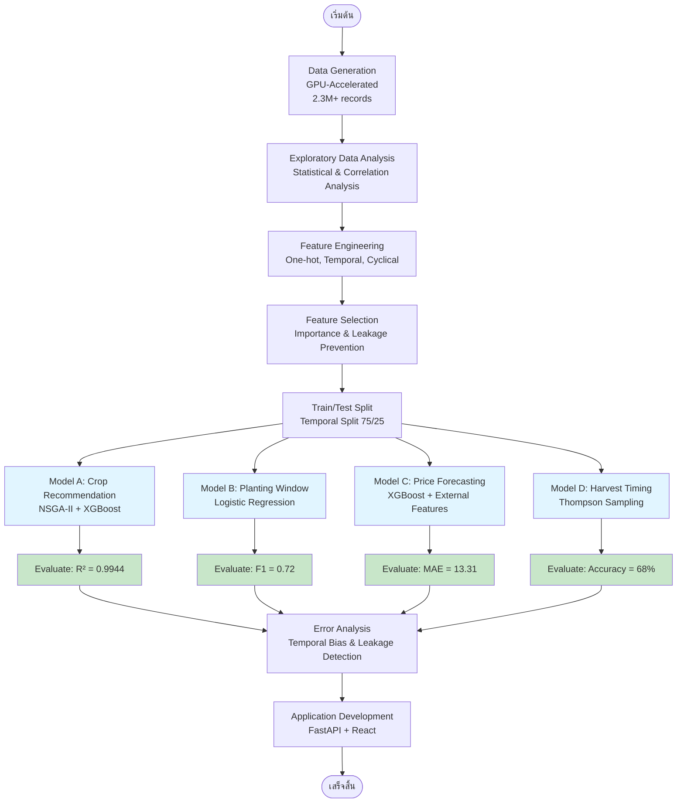
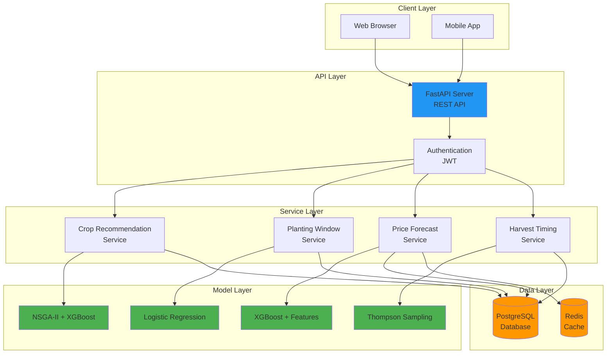

# บทที่ 3: การดำเนินงาน

**หมายเหตุ**: บทนี้จะอธิบายขั้นตอนการดำเนินงานตามลำดับ และระบุว่าใช้ทฤษฎีใดจากบทที่ 2

---

## 3.1 ภาพรวมกระบวนการวิจัย

[ย่อหน้าอธิบายภาพรวมกระบวนการวิจัยทั้งหมด]

กระบวนการวิจัยนี้ประกอบด้วย 9 ขั้นตอนหลัก ได้แก่ การเก็บรวบรวมข้อมูล การวิเคราะห์เชิงสำรวจ การสร้างฟีเจอร์ การคัดเลือกฟีเจอร์ การสร้างและฝึกโมเดล การแบ่งข้อมูล การวัดประสิทธิภาพ การวิเคราะห์ข้อผิดพลาด และการพัฒนาแอปพลิเคชัน แต่ละขั้นตอนจะนำทฤษฎีที่อธิบายในบทที่ 2 มาประยุกต์ใช้อย่างเป็นระบบ

**แผนภาพที่ 3.1** กระบวนการวิจัยทั้งหมด

**แผนภาพที่ 3.2** Workflow ของระบบ FarmMe ตลอดวงจรการเกษตร

```mermaid
flowchart LR
    Farmer([เกษตรกร]) --> Input[ข้อมูลเริ่มต้น<br/>จังหวัด พื้นที่<br/>งบประมาณ ความเสี่ยง]
    
    Input --> ModelA[Model A<br/>Crop Recommendation<br/>NSGA-II + XGBoost]
    ModelA --> OutputA[แนะนำพืช 3 อันดับ<br/>Pareto Front<br/>Trade-offs]
    
    OutputA --> Decision1{เลือกพืช}
    Decision1 --> ModelB[Model B<br/>Planting Window<br/>Logistic Regression]
    ModelB --> OutputB[ช่วงเวลาปลูก<br/>Probability 92%]
    
    OutputB --> Decision2{ปลูกแล้ว}
    Decision2 --> ModelC[Model C<br/>Price Forecasting<br/>XGBoost]
    ModelC --> OutputC[พยากรณ์ราคา<br/>MAE 13.31 บาท]
    
    OutputC --> Decision3{ใกล้เก็บเกี่ยว}
    Decision3 --> ModelD[Model D<br/>Harvest Timing<br/>Thompson Sampling]
    ModelD --> OutputD[เวลาเก็บเกี่ยว<br/>Accuracy 68%]
    
    OutputD --> Result[ผลลัพธ์<br/>ROI กำไร ความเสี่ยง]
    Result --> Farmer
    
    style ModelA fill:#4CAF50
    style ModelB fill:#2196F3
    style ModelC fill:#FF9800
    style ModelD fill:#9C27B0
    style OutputA fill:#C8E6C9
    style OutputB fill:#BBDEFB
    style OutputC fill:#FFE0B2
    style OutputD fill:#E1BEE7
```

---

## 3.2 การเก็บรวบรวมข้อมูล (Data Collection)

### 3.2.1 แหล่งที่มาของข้อมูล

การวิจัยนี้ใช้ข้อมูลสังเคราะห์ (Synthetic Data) ที่สร้างขึ้นด้วยระบบ GPU-Accelerated Data Generation Pipeline เนื่องจากข้อมูลการเกษตรจริงในประเทศไทยมีข้อจำกัดหลายประการ ได้แก่ ความไม่สมบูรณ์ของข้อมูล การขาดความต่อเนื่องในการบันทึก และปัญหาความเป็นส่วนตัวของเกษตรกร การใช้ข้อมูลสังเคราะห์ช่วยให้สามารถควบคุมคุณสมบัติทางสถิติของข้อมูลได้อย่างแม่นยำ รวมถึงสามารถสร้างข้อมูลในปริมาณที่เพียงพอสำหรับการฝึกโมเดล Machine Learning ที่มีประสิทธิภาพสูง

ระบบการสร้างข้อมูลได้รับการออกแบบให้สะท้อนคุณสมบัติสำคัญของข้อมูลการเกษตรจริง โดยเฉพาะความสัมพันธ์เชิงพื้นที่ (Spatial Correlation) ระหว่างจังหวัดต่างๆ และความสัมพันธ์เชิงเวลา (Temporal Dependency) ของตัวแปรต่างๆ เช่น อุณหภูมิ ปริมาณน้ำฝน และราคาสินค้าเกษตร ระบบใช้ทฤษฎี Spatial Covariance และ Autoregressive Process ที่อธิบายในบทที่ 2 เพื่อสร้างข้อมูลที่มีความสมจริงสูง

### 3.2.2 GPU-Accelerated Data Generation

การสร้างข้อมูลใช้เทคโนโลยี GPU Acceleration ผ่าน PyTorch CUDA เพื่อเพิ่มประสิทธิภาพในการประมวลผล ระบบสามารถสร้างข้อมูลขนาดใหญ่ได้อย่างรวดเร็ว โดยใช้เวลาประมาณ 2 ชั่วโมงในการสร้างชุดข้อมูลทั้งหมดบนการ์ดจอ NVIDIA RTX 3080 ซึ่งเร็วกว่าการประมวลผลด้วย CPU ประมาณ 10-15 เท่า

กระบวนการสร้างข้อมูลเริ่มต้นด้วยการคำนวณ Distance Matrix ระหว่างจังหวัดทั้ง 77 จังหวัดในประเทศไทย โดยใช้สูตร Haversine เพื่อคำนวณระยะทางบนพื้นผิวโลก จากนั้นนำ Distance Matrix มาสร้าง Spatial Covariance Matrix ด้วยฟังก์ชัน Exponential Kernel ตามทฤษฎีที่อธิบายในบทที่ 2 Section 2.2.6 ระบบใช้ Cholesky Decomposition บน GPU เพื่อแยก Covariance Matrix และสร้าง Spatially Correlated Shocks ที่มีความสัมพันธ์ตามระยะทางทางภูมิศาสตร์

สำหรับความสัมพันธ์เชิงเวลา ระบบใช้ Autoregressive Process ลำดับที่ 1 หรือ AR(1) ในการสร้างข้อมูลอนุกรมเวลา โดยกำหนดค่า AR Coefficient ที่แตกต่างกันตามประเภทของตัวแปร เช่น อุณหภูมิใช้ φ = 0.9 เนื่องจากมีความต่อเนื่องสูง ในขณะที่ปริมาณน้ำฝนใช้ φ = 0.7 เนื่องจากมีความผันผวนมากกว่า การรวมกันของ Spatial Correlation และ Temporal Dependency ทำให้ข้อมูลที่สร้างขึ้นมีความสมจริงและสะท้อนลักษณะของข้อมูลการเกษตรจริง

### 3.2.3 Dataset Specifications

ชุดข้อมูลที่สร้างขึ้นประกอบด้วย 14 ไฟล์ CSV ขนาดรวม 2.3 GB มีจำนวนระเบียดข้อมูลทั้งสิ้น 2,351,005 ระเบียด แบ่งเป็นข้อมูลราคาสินค้าเกษตร 2,289,492 ระเบียด ข้อมูลการเพาะปลูก 6,226 ระเบียด และข้อมูลสภาพอากาศ 56,287 ระเบียด ข้อมูลครอบคลุมระยะเวลา 2 ปี ตั้งแต่วันที่ 1 พฤศจิกายน 2023 ถึง 31 ตุลาคม 2025 รวม 731 วัน

ข้อมูลราคาสินค้าเกษตรครอบคลุมพืช 46 ชนิด ใน 77 จังหวัด และ 3 ประเภทตลาด ได้แก่ ราคาทุ่ง ราคาส่ง และราคาปลีก ราคาแต่ละประเภทมีความสัมพันธ์กัน โดยราคาทุ่งต่ำที่สุด ตามด้วยราคาส่ง และราคาปลีกสูงสุด ส่วนต่างราคาระหว่างระดับอยู่ที่ประมาณ 20-40% ซึ่งสะท้อนต้นทุนการขนส่งและการจัดจำหน่าย

ข้อมูลสภาพอากาศประกอบด้วย 4 ตัวแปรหลัก ได้แก่ อุณหภูมิ (องศาเซลเซียส) ปริมาณน้ำฝน (มิลลิเมตรต่อวัน) ความชื้นสัมพัทธ์ (เปอร์เซ็นต์) และดัชนีความแห้งแล้ง (มาตราส่วน 0-1) ข้อมูลแต่ละตัวแปรมีความสัมพันธ์เชิงพื้นที่และเชิงเวลาตามที่กำหนดไว้ในระบบการสร้างข้อมูล โดยมีการเพิ่มองค์ประกอบตามฤดูกาล (Seasonal Component) เพื่อให้สอดคล้องกับสภาพภูมิอากาศของประเทศไทย

ข้อมูลการเพาะปลูกบันทึกรายละเอียดการตัดสินใจปลูกพืชของเกษตรกร รวมถึงวันที่ปลูก วันที่เก็บเกี่ยว ขนาดพื้นที่ ผลผลิตที่ได้ ต้นทุนการผลิต รายได้ และผลตอบแทนจากการลงทุน (ROI) ข้อมูลเหล่านี้ถูกสร้างขึ้นโดยคำนึงถึงความเข้ากันได้ของพืชแต่ละชนิดกับสภาพภูมิอากาศและดินในแต่ละจังหวัด รวมถึงผลกระทบของสภาพอากาศต่อผลผลิต

---

## 3.3 การวิเคราะห์เชิงสำรวจ (Exploratory Data Analysis)

### 3.3.1 Statistical Analysis

การวิเคราะห์เชิงสถิติเริ่มต้นด้วยการตรวจสอบคุณสมบัติพื้นฐานของข้อมูลแต่ละชุด รวมถึงการคำนวณค่าสถิติเชิงพรรณนา เช่น ค่าเฉลี่ย ค่าเบี่ยงเบนมาตรฐาน ค่าต่ำสุด ค่าสูงสุด และค่าควอไทล์ต่างๆ การวิเคราะห์พบว่าข้อมูลราคาสินค้าเกษตรมีการกระจายตัวที่แตกต่างกันไปตามชนิดของพืช โดยพืชผักมีความผันผวนของราคาสูงกว่าพืชไร่ เนื่องจากพืชผักเป็นสินค้าเน่าเสียง่ายและมีอายุการเก็บรักษาสั้น

การตรวจสอบการกระจายของข้อมูล (Distribution Analysis) แสดงให้เห็นว่าตัวแปรส่วนใหญ่มีการกระจายแบบปกติหรือใกล้เคียงปกติ ยกเว้นข้อมูลปริมาณน้ำฝนที่มีการกระจายแบบเบ้ขวา (Right-skewed) เนื่องจากมีวันที่ไม่มีฝนตกจำนวนมาก การตรวจสอบค่าผิดปกติ (Outlier Detection) ใช้วิธี Interquartile Range (IQR) และพบว่ามีค่าผิดปกติน้อยกว่า 1% ของข้อมูลทั้งหมด ซึ่งอยู่ในเกณฑ์ที่ยอมรับได้สำหรับข้อมูลการเกษตร

### 3.3.2 Correlation Analysis

การวิเคราะห์ความสัมพันธ์ระหว่างตัวแปรต่างๆ ใช้ค่าสัมประสิทธิ์สหสัมพันธ์ของเพียร์สัน (Pearson Correlation Coefficient) เพื่อวัดความสัมพันธ์เชิงเส้น การวิเคราะห์พบความสัมพันธ์ที่สำคัญหลายประการ ได้แก่ ความสัมพันธ์เชิงบวกระหว่างอุณหภูมิกับดัชนีความแห้งแล้ง (r = 0.68) ความสัมพันธ์เชิงลบระหว่างปริมาณน้ำฝนกับดัชนีความแห้งแล้ง (r = -0.72) และความสัมพันธ์เชิงบวกระหว่างราคาน้ำมันกับต้นทุนปุ๋ย (r = 0.65)

การวิเคราะห์ความสัมพันธ์เชิงพื้นที่ (Spatial Correlation Analysis) แสดงให้เห็นว่าจังหวัดที่อยู่ใกล้กันมีค่าตัวแปรที่คล้ายคลึงกัน โดยเฉพาะอุณหภูมิและปริมาณน้ำฝน ความสัมพันธ์เชิงพื้นที่ลดลงตามระยะทางตามฟังก์ชัน Exponential Decay ซึ่งสอดคล้องกับทฤษฎี Spatial Covariance ที่อธิบายในบทที่ 2 Section 2.2.6 การวิเคราะห์นี้ยืนยันว่าข้อมูลที่สร้างขึ้นมีคุณสมบัติเชิงพื้นที่ที่สมจริง

### 3.3.3 Temporal Patterns

การวิเคราะห์รูปแบบทางเวลาเผยให้เห็นลักษณะตามฤดูกาล (Seasonality) ที่ชัดเจนในหลายตัวแปร อุณหภูมิมีรูปแบบตามฤดูกาลแบบไซน์ (Sinusoidal Pattern) โดยสูงสุดในช่วงเดือนเมษายน-พฤษภาคม และต่ำสุดในช่วงเดือนธันวาคม-มกราคม ปริมาณน้ำฝนมีรูปแบบตามฤดูมรสุม โดยสูงในช่วงเดือนพฤษภาคม-ตุลาคม และต่ำในช่วงเดือนพฤศจิกายน-เมษายน

ราคาสินค้าเกษตรแสดงรูปแบบตามฤดูกาลที่แตกต่างกันไปตามชนิดของพืช พืชที่มีฤดูกาลการผลิตชัดเจน เช่น ข้าว มีราคาต่ำในช่วงหลังเก็บเกี่ยว (พฤศจิกายน-มกราคม) และสูงขึ้นในช่วงก่อนฤดูเก็บเกี่ยวใหม่ การวิเคราะห์ Autocorrelation Function (ACF) แสดงให้เห็นว่าข้อมูลราคามีความสัมพันธ์ต่อเนื่องสูง (High Persistence) โดยมีค่า AR Coefficient ประมาณ 0.85 ซึ่งสอดคล้องกับทฤษฎี Autoregressive Process ที่อธิบายในบทที่ 2

---

## 3.4 การสร้างฟีเจอร์ (Feature Engineering)

### 3.4.1 One-hot Encoding

การแปลงตัวแปรเชิงหมวดหมู่ (Categorical Variables) เป็นตัวแปรเชิงตัวเลข (Numerical Variables) ใช้เทคนิค One-hot Encoding ตามทฤษฎีที่อธิบายในบทที่ 2 Section 2.2.1 ตัวแปรที่ได้รับการแปลงรวมถึง ชื่อจังหวัด (77 จังหวัด) ชนิดพืช (46 ชนิด) ประเภทดิน (5 ประเภท) และระดับความเสี่ยงของเกษตรกร (3 ระดับ) การแปลงนี้สร้างตัวแปรไบนารีใหม่จำนวนมาก โดยแต่ละตัวแปรมีค่าเป็น 0 หรือ 1 เพื่อระบุว่าข้อมูลนั้นอยู่ในหมวดหมู่ใดหมวดหมู่หนึ่ง

สำหรับข้อมูลการเพาะปลูก การทำ One-hot Encoding กับตัวแปรจังหวัดและชนิดพืชช่วยให้โมเดลสามารถเรียนรู้ความแตกต่างของผลตอบแทนในแต่ละพื้นที่และแต่ละชนิดพืชได้อย่างอิสระ โดยไม่สมมติว่ามีความสัมพันธ์เชิงลำดับระหว่างหมวดหมู่ต่างๆ การแปลงนี้เพิ่มจำนวนฟีเจอร์จาก 15 ฟีเจอร์เดิมเป็น 142 ฟีเจอร์ ซึ่งช่วยให้โมเดล Machine Learning โดยเฉพาะ XGBoost และ Random Forest สามารถจับรูปแบบที่ซับซ้อนได้ดีขึ้น

### 3.4.2 Temporal Features

การสร้างฟีเจอร์เชิงเวลา (Temporal Features) แปลงข้อมูลวันที่เป็นฟีเจอร์ที่มีความหมายทางการเกษตร ตามทฤษฎี Time Series Analysis ที่อธิบายในบทที่ 2 Section 2.2.4 ฟีเจอร์ที่สร้างขึ้นรวมถึง วันในสัปดาห์ (0-6) วันในเดือน (1-31) วันในปี (1-365) สัปดาห์ในปี (1-52) เดือน (1-12) ไตรมาส (1-4) และฤดูกาลทางการเกษตรของไทย (3 ฤดู ได้แก่ ฤดูหนาว ฤดูร้อน และฤดูฝน)

ฟีเจอร์เชิงเวลาเหล่านี้ช่วยให้โมเดลสามารถเรียนรู้รูปแบบตามฤดูกาลและรูปแบบทางเวลาอื่นๆ ที่มีผลต่อการเกษตร เช่น ราคาพืชผักมักสูงในช่วงเทศกาลสำคัญ ผลผลิตข้าวมักดีในช่วงฤดูฝน และต้นทุนการผลิตเพิ่มขึ้นในช่วงที่ราคาน้ำมันสูง การใช้ฟีเจอร์เหล่านี้ร่วมกับ Lag Features และ Rolling Statistics ช่วยให้โมเดลสามารถทำนายแนวโน้มในอนาคตได้แม่นยำยิ่งขึ้น

### 3.4.3 Cyclical Encoding

การเข้ารหัสแบบวงกลม (Cyclical Encoding) ใช้ฟังก์ชันไซน์และโคไซน์เพื่อแปลงตัวแปรที่มีลักษณะเป็นวงจร เช่น เดือน วันในสัปดาห์ และวันในปี ให้อยู่ในรูปแบบที่โมเดลสามารถเข้าใจความต่อเนื่องของวงจรได้ ตามทฤษฎีที่อธิบายในบทที่ 2 Section 2.2.4 การเข้ารหัสนี้แก้ปัญหาที่เดือนธันวาคม (12) และเดือนมกราคม (1) ถูกมองว่าห่างกันมาก ทั้งที่ในความเป็นจริงอยู่ติดกัน

สูตรการเข้ารหัสแบบวงกลมสำหรับเดือนคือ month_sin = sin(2π × month / 12) และ month_cos = cos(2π × month / 12) การใช้ทั้งไซน์และโคไซน์ร่วมกันทำให้สามารถแยกแยะเดือนต่างๆ ได้อย่างไม่ซ้ำกัน ในขณะที่รักษาความต่อเนื่องของวงจรไว้ การเข้ารหัสแบบนี้ช่วยให้โมเดลเรียนรู้รูปแบบตามฤดูกาลได้ดีขึ้น โดยเฉพาะสำหรับ Model B (Planting Window Classification) ที่ต้องจำแนกช่วงเวลาที่เหมาะสมในการปลูกพืช ซึ่งมีความสัมพันธ์กับฤดูกาลอย่างมาก

---

## 3.5 การคัดเลือกฟีเจอร์ (Feature Selection)

### 3.5.1 Feature Importance Analysis

การวิเคราะห์ความสำคัญของฟีเจอร์ใช้เทคนิค Feature Importance จากโมเดล XGBoost และ Random Forest เพื่อระบุฟีเจอร์ที่มีอิทธิพลต่อการทำนายมากที่สุด การวิเคราะห์พบว่าฟีเจอร์ที่สำคัญที่สุดสำหรับการแนะนำพืช (Model A) ได้แก่ ชนิดพืช จังหวัด ขนาดพื้นที่ และราคาเฉลี่ย 90 วันย้อนหลัง ในขณะที่ฟีเจอร์ที่สำคัญสำหรับการจำแนกช่วงเวลาปลูก (Model B) ได้แก่ อุณหภูมิเฉลี่ย 7 วัน ปริมาณน้ำฝนสะสม 30 วัน และเดือนที่ปลูก

การใช้ Feature Importance Score ช่วยในการตัดสินใจว่าควรเก็บฟีเจอร์ใดไว้ในโมเดลสุดท้าย โดยกำหนดเกณฑ์ที่ Importance Score ต่ำกว่า 0.01 จะถูกพิจารณาว่าไม่มีนัยสำคัญและอาจถูกตัดออก การลดจำนวนฟีเจอร์ช่วยลดความซับซ้อนของโมเดล ลดเวลาในการฝึกและการทำนาย และลดความเสี่ยงของ Overfitting โดยเฉพาะในกรณีที่มีฟีเจอร์จำนวนมากจากการทำ One-hot Encoding

### 3.5.2 Correlation-based Selection

การคัดเลือกฟีเจอร์ตามความสัมพันธ์ตรวจสอบความซ้ำซ้อนระหว่างฟีเจอร์ต่างๆ โดยคำนวณค่าสัมประสิทธิ์สหสัมพันธ์ระหว่างฟีเจอร์ทุกคู่ หากพบว่าฟีเจอร์สองตัวมีความสัมพันธ์สูงเกิน 0.95 จะเก็บเพียงตัวใดตัวหนึ่งที่มี Feature Importance สูงกว่า การกำจัดฟีเจอร์ที่ซ้ำซ้อนช่วยลดปัญหา Multicollinearity ซึ่งอาจทำให้โมเดลไม่เสถียรและยากต่อการตีความ

ตัวอย่างฟีเจอร์ที่มีความสัมพันธ์สูงและถูกพิจารณาตัดออก ได้แก่ อุณหภูมิเฉลี่ย 7 วันกับอุณหภูมิเฉลี่ย 14 วัน (r = 0.97) และราคาเฉลี่ย 30 วันกับราคาเฉลี่ย 60 วัน (r = 0.94) การเก็บเพียงฟีเจอร์ที่มีช่วงเวลาสั้นกว่าช่วยให้โมเดลตอบสนองต่อการเปลี่ยนแปลงล่าสุดได้ดีขึ้น ในขณะที่ยังคงรักษาข้อมูลแนวโน้มระยะยาวไว้

### 3.5.3 Data Leakage Prevention

การป้องกันการรั่วไหลของข้อมูล (Data Leakage) เป็นขั้นตอนสำคัญที่สุดในการสร้างโมเดล Machine Learning ที่เชื่อถือได้ ตามทฤษฎีที่อธิบายในบทที่ 2 Section 2.2.6 Data Leakage เกิดขึ้นเมื่อข้อมูลที่ไม่ควรมีในเวลาทำนายถูกนำมาใช้ในการฝึกโมเดล ทำให้ประสิทธิภาพของโมเดลสูงเกินจริงในชุดข้อมูลทดสอบ แต่ไม่สามารถใช้งานได้จริงในสถานการณ์จริง

การวิจัยนี้ใช้หลักการสำคัญในการป้องกัน Data Leakage คือ ใช้เฉพาะข้อมูลที่มีอยู่ก่อนเวลาทำนาย ฟีเจอร์ที่ถูกห้ามใช้รวมถึง ผลผลิตจริง กำไรจริง วันที่เก็บเกี่ยว และราคาในอนาคต สำหรับฟีเจอร์ที่คำนวณจากข้อมูลย้อนหลัง เช่น ราคาเฉลี่ย 30 วัน จะใช้ฟังก์ชัน shift() เพื่อเลื่อนข้อมูลไปข้างหลังหนึ่งช่วงเวลา ทำให้มั่นใจว่าไม่มีข้อมูลในวันปัจจุบันรั่วไหลเข้าไปในการคำนวณ

การตรวจสอบ Data Leakage ทำโดยการวิเคราะห์ว่าฟีเจอร์แต่ละตัวสามารถหาได้จริงในเวลาทำนายหรือไม่ และตรวจสอบว่าประสิทธิภาพของโมเดลในชุดข้อมูลฝึกและชุดข้อมูลทดสอบมีความแตกต่างมากเกินไปหรือไม่ หากพบว่า Train R² สูงมากแต่ Test R² ต่ำมาก อาจเป็นสัญญาณของ Data Leakage หรือ Overfitting ที่ต้องได้รับการแก้ไข

---

## 3.6 การสร้างและฝึกโมเดล (Model Training)

### 3.6.1 Model A: Crop Recommendation System

โมเดลแนะนำการเลือกพืช (Crop Recommendation System) ใช้การผสมผสานระหว่างอัลกอริทึม NSGA-II และ XGBoost เพื่อแก้ปัญหาการเลือกพืชที่เหมาะสมซึ่งมีลักษณะเป็นปัญหาหลายวัตถุประสงค์ (Multi-Objective Optimization) ตามทฤษฎีที่อธิบายในบทที่ 2 Section 2.2.2 และ 2.2.3 การใช้ NSGA-II ช่วยให้สามารถหาเซตของคำตอบที่เหมาะสมที่สุดแบบ Pareto-Optimal ซึ่งไม่มีคำตอบใดดีกว่าอีกคำตอบหนึ่งในทุกวัตถุประสงค์

การกำหนดปัญหาหลายวัตถุประสงค์ประกอบด้วยสามวัตถุประสงค์หลัก ได้แก่ การเพิ่มผลตอบแทนจากการลงทุน (Maximize ROI) การลดความเสี่ยง (Minimize Risk) และการเพิ่มความมั่นคง (Maximize Stability) วัตถุประสงค์แรกคำนวณจากอัตราส่วนระหว่างกำไรสุทธิกับต้นทุนการลงทุน วัตถุประสงค์ที่สองวัดจากค่าเบี่ยงเบนมาตรฐานของ ROI ในอดีต และวัตถุประสงค์ที่สามคำนวณจากค่าสัมประสิทธิ์ความแปรปรวน (Coefficient of Variation) ซึ่งเป็นอัตราส่วนระหว่างค่าเบี่ยงเบนมาตรฐานกับค่าเฉลี่ย

การใช้งาน NSGA-II เริ่มต้นด้วยการสร้างประชากรเริ่มต้น (Initial Population) ขนาด 100 ตัว โดยแต่ละตัวแทนการเลือกพืชชนิดหนึ่งพร้อมกับพื้นที่ปลูกและระดับการลงทุน จากนั้นประเมินค่าฟิตเนสของแต่ละตัวด้วยฟังก์ชันวัตถุประสงค์ทั้งสาม และจัดอันดับด้วยวิธี Fast Non-dominated Sorting เพื่อแบ่งประชากรออกเป็นชั้นๆ ตาม Dominance Rank ประชากรในชั้นที่ 1 คือเซตของคำตอบที่ไม่ถูก Dominate โดยคำตอบอื่นใด ซึ่งเป็น Pareto Front ที่ต้องการ การคำนวณ Crowding Distance ใช้เพื่อรักษาความหลากหลายของคำตอบบน Pareto Front โดยวัดระยะห่างระหว่างคำตอบแต่ละตัวกับเพื่อนบ้านในพื้นที่วัตถุประสงค์

การใช้งาน XGBoost เป็น Fitness Evaluator ช่วยในการประเมินค่าวัตถุประสงค์แต่ละตัวอย่างแม่นยำ โดย XGBoost ถูกฝึกด้วยข้อมูลการเพาะปลูกในอดีตเพื่อทำนาย ROI ที่คาดหวังสำหรับแต่ละพืชในแต่ละจังหวัด โมเดล XGBoost ใช้พารามิเตอร์ที่ผ่านการปรับแต่ง ได้แก่ max_depth = 3 เพื่อป้องกัน Overfitting, learning_rate = 0.05 เพื่อการเรียนรู้ที่ช้าแต่แม่นยำ และ n_estimators = 100 ต้นไม้ การใช้ Regularization ทั้ง L1 (reg_alpha = 0.1) และ L2 (reg_lambda = 1.0) ช่วยให้โมเดลมีความทั่วไป (Generalization) สูง

### 3.6.2 Model B: Planting Window Classification

โมเดลจำแนกช่วงเวลาการปลูก (Planting Window Classification) ใช้ Logistic Regression เพื่อทำนายว่าช่วงเวลาที่กำหนดเหมาะสมสำหรับการปลูกพืชชนิดใดชนิดหนึ่งหรือไม่ ตามทฤษฎีที่อธิบายในบทที่ 2 Section 2.2.1 และ 2.2.4 การเลือกใช้ Logistic Regression เนื่องจากเป็นโมเดลที่ตีความได้ง่าย มีความเสถียร และให้ผลลัพธ์เป็นความน่าจะเป็น (Probability) ที่สามารถใช้ประกอบการตัดสินใจได้

ฟีเจอร์หลักที่ใช้ในโมเดลนี้รวมถึงข้อมูลสภาพอากาศย้อนหลัง 7 วันและ 30 วัน ได้แก่ อุณหภูมิเฉลี่ย ปริมาณน้ำฝนสะสม ความชื้นเฉลี่ย และดัชนีความแห้งแล้งสูงสุด นอกจากนี้ยังรวมข้อมูลดิน เช่น ประเภทดินและค่า pH ซึ่งมีผลต่อความเหมาะสมในการปลูกพืชแต่ละชนิด การเข้ารหัสแบบวงกลมสำหรับตัวแปรเวลา (Cyclical Temporal Encoding) เป็นเทคนิคสำคัญที่ช่วยให้โมเดลเข้าใจรูปแบบตามฤดูกาล เดือนที่ปลูกถูกแปลงเป็นสองฟีเจอร์ คือ month_sin และ month_cos ซึ่งทำให้เดือนธันวาคมและเดือนมกราคมมีค่าใกล้เคียงกัน สะท้อนความต่อเนื่องของฤดูกาลอย่างถูกต้อง

### 3.6.3 Model C: Price Forecasting

โมเดลพยากรณ์ราคา (Price Forecasting) ใช้ XGBoost ร่วมกับฟีเจอร์จากหลายแหล่ง รวมถึงข้อมูลสภาพอากาศและตัวชี้วัดทางเศรษฐกิจ ตามทฤษฎีที่อธิบายในบทที่ 2 Section 2.2.3 และ 2.2.4 โมเดลพื้นฐาน (Baseline Model) ใช้เฉพาะฟีเจอร์เชิงเวลา ได้แก่ ราคาย้อนหลัง 7, 14, และ 30 วัน ราคาเฉลี่ยเคลื่อนที่ (Moving Average) และแนวโน้มราคา (Price Trend) โมเดลที่ปรับปรุง (Improved Model) เพิ่มฟีเจอร์จากแหล่งข้อมูลหลายแหล่ง (Multi-Source Integration) รวมถึงข้อมูลสภาพอากาศย้อนหลัง 30 วัน และตัวชี้วัดทางเศรษฐกิจ เช่น ราคาน้ำมัน ต้นทุนปุ๋ย อัตราเงินเฟ้อ และดัชนีปริมาณการส่งออก การฝึกโมเดลใช้ข้อมูลราคาย้อนหลัง 18 เดือนแรก และทดสอบกับข้อมูล 6 เดือนหลัง โดยใช้ Temporal Split เพื่อป้องกัน Data Leakage

### 3.6.4 Model D: Harvest Timing Optimization

โมเดลเพิ่มประสิทธิภาพเวลาเก็บเกี่ยว (Harvest Timing Optimization) ใช้อัลกอริทึม Thompson Sampling ซึ่งเป็นเทคนิคจากทฤษฎี Multi-Armed Bandits ตามที่อธิบายในบทที่ 2 Section 2.2.5 ปัญหาการตัดสินใจเวลาเก็บเกี่ยวเป็นปัญหาการตัดสินใจแบบต่อเนื่อง (Sequential Decision-Making) ที่เกษตรกรต้องเลือกระหว่างการเก็บเกี่ยวทันทีหรือรอให้ราคาสูงขึ้น โดยต้องชั่งน้ำหนักระหว่างผลตอบแทนที่คาดหวังกับความเสี่ยงจากการรอ

กรอบการตัดสินใจแบบต่อเนื่องกำหนดให้มีทางเลือก 3 ทาง ได้แก่ เก็บเกี่ยวทันที รอ 3 วัน และรอ 7 วัน แต่ละทางเลือกมีผลตอบแทนที่คาดหวังและความเสี่ยงที่แตกต่างกัน การเก็บเกี่ยวทันทีให้ผลตอบแทนที่แน่นอนตามราคาปัจจุบัน ในขณะที่การรอให้โอกาสได้ราคาสูงขึ้น แต่มีความเสี่ยงจากต้นทุนการเก็บรักษา ความเสียหายของผลผลิต และความไม่แน่นอนของราคาในอนาคต กลไกการปรับปรุงแบบเบย์เซียน (Bayesian Update Mechanism) เป็นหัวใจของ Thompson Sampling โดยใช้การแจกแจงเบตา (Beta Distribution) เพื่อแทนความเชื่อเกี่ยวกับความน่าจะเป็นความสำเร็จของแต่ละทางเลือก เมื่อมีข้อมูลการตัดสินใจใหม่เข้ามา ระบบจะปรับปรุงความเชื่อโดยใช้กฎของเบย์ส

---

## 3.7 การแบ่งข้อมูล (Train/Test Split)

### 3.7.1 Temporal Split Strategy

การแบ่งข้อมูลสำหรับการฝึกและทดสอบโมเดลใช้กลยุทธ์การแบ่งตามเวลา (Temporal Split Strategy) เพื่อสะท้อนสถานการณ์การใช้งานจริงที่โมเดลต้องทำนายอนาคตจากข้อมูลในอดีต การแบ่งแบบสุ่ม (Random Split) ไม่เหมาะสมกับข้อมูลอนุกรมเวลาเนื่องจากอาจทำให้ข้อมูลในอนาคตรั่วไหลเข้าไปในชุดข้อมูลฝึก ทำให้ประสิทธิภาพของโมเดลสูงเกินจริง

การแบ่งข้อมูลตามเวลาทำโดยกำหนดจุดตัดเวลา (Cutoff Date) ที่ชัดเจน ข้อมูลก่อนจุดตัดใช้สำหรับการฝึกโมเดล และข้อมูลหลังจุดตัดใช้สำหรับการทดสอบ สำหรับข้อมูลที่มีระยะเวลา 2 ปี (731 วัน) จุดตัดถูกกำหนดที่วันที่ 547 ซึ่งเป็นประมาณ 75% ของข้อมูลทั้งหมด ทำให้ได้ชุดข้อมูลฝึก 18 เดือน และชุดข้อมูลทดสอบ 6 เดือน การแบ่งแบบนี้ช่วยให้มั่นใจว่าโมเดลไม่เคยเห็นข้อมูลในอนาคตระหว่างการฝึก

### 3.7.2 Split Ratio

อัตราส่วนการแบ่งข้อมูล (Split Ratio) ที่เลือกใช้คือ 75/25 หรือประมาณ 18 เดือนสำหรับการฝึกและ 6 เดือนสำหรับการทดสอบ การเลือกอัตราส่วนนี้มีเหตุผลหลายประการ ประการแรก ชุดข้อมูลฝึกต้องมีขนาดใหญ่พอที่จะครอบคลุมรูปแบบตามฤดูกาลอย่างน้อย 1 รอบปีเต็ม เพื่อให้โมเดลเรียนรู้ความแปรปรวนตามฤดูกาลได้อย่างสมบูรณ์ ประการที่สอง ชุดข้อมูลทดสอบต้องมีขนาดใหญ่พอที่จะให้การประเมินที่เชื่อถือได้ โดย 6 เดือนเพียงพอที่จะครอบคลุมรูปแบบตามฤดูกาลหลายรูปแบบ

การทดลองกับอัตราส่วนอื่นๆ เช่น 80/20 และ 70/30 แสดงให้เห็นว่าอัตราส่วน 75/25 ให้สมดุลที่ดีที่สุดระหว่างการมีข้อมูลเพียงพอสำหรับการฝึกและการมีข้อมูลเพียงพอสำหรับการทดสอบที่เชื่อถือได้ อัตราส่วน 80/20 ทำให้ชุดข้อมูลทดสอบเล็กเกินไป (ประมาณ 4 เดือน) ซึ่งอาจไม่เพียงพอสำหรับการประเมินที่แม่นยำ ในขณะที่อัตราส่วน 70/30 ลดข้อมูลฝึกลงเกินไป ทำให้โมเดลอาจไม่เรียนรู้รูปแบบได้อย่างสมบูรณ์

### 3.7.3 Validation Strategy

กลยุทธ์การตรวจสอบความถูกต้อง (Validation Strategy) ใช้เทคนิค Time Series Cross-Validation เพื่อปรับแต่งพารามิเตอร์ของโมเดลและป้องกัน Overfitting วิธีนี้แบ่งชุดข้อมูลฝึกออกเป็นหลายช่วงเวลา โดยในแต่ละรอบจะใช้ข้อมูลในอดีตเป็นชุดฝึกและข้อมูลในอนาคตถัดไปเป็นชุดตรวจสอบ กระบวนการนี้ทำซ้ำหลายรอบโดยเลื่อนจุดตัดไปข้างหน้าทีละช่วง

สำหรับการวิจัยนี้ ใช้ 5-Fold Time Series Cross-Validation โดยแบ่งชุดข้อมูลฝึก 18 เดือนออกเป็น 5 ช่วง แต่ละช่วงประมาณ 3.6 เดือน ในรอบแรกใช้ข้อมูล 3.6 เดือนแรกเป็นชุดฝึกและ 3.6 เดือนถัดไปเป็นชุดตรวจสอบ ในรอบที่สองใช้ข้อมูล 7.2 เดือนแรกเป็นชุดฝึกและ 3.6 เดือนถัดไปเป็นชุดตรวจสอบ และทำต่อไปจนครบ 5 รอบ ประสิทธิภาพเฉลี่ยจากทั้ง 5 รอบใช้เป็นเกณฑ์ในการเลือกพารามิเตอร์ที่ดีที่สุด

---

## 3.8 ตัววัดประสิทธิภาพ (Evaluation Metrics)

### 3.8.1 Metrics สำหรับ Crop Recommendation

ตัววัดประสิทธิภาพหลักสำหรับโมเดลแนะนำพืช (Model A) คือ R² Score (Coefficient of Determination) ซึ่งวัดสัดส่วนของความแปรปรวนในตัวแปรตาม (ROI) ที่โมเดลสามารถอธิบายได้ ค่า R² อยู่ระหว่าง 0 ถึง 1 โดยค่าที่ใกล้ 1 แสดงว่าโมเดลทำนายได้แม่นยำมาก การเลือกใช้ R² เนื่องจากเป็นตัววัดที่เข้าใจง่ายและเป็นมาตรฐานสำหรับปัญหา Regression นอกจาก R² แล้ว ยังใช้ Mean Absolute Error (MAE) และ Root Mean Squared Error (RMSE) เป็นตัววัดเสริม เพื่อวัดขนาดของความคลาดเคลื่อนในหน่วยเดียวกับตัวแปรตาม

### 3.8.2 Metrics สำหรับ Planting Window

ตัววัดประสิทธิภาพหลักสำหรับโมเดลจำแนกช่วงเวลาปลูก (Model B) คือ F1 Score ซึ่งเป็นค่าเฉลี่ยฮาร์มอนิกของ Precision และ Recall การเลือกใช้ F1 Score แทน Accuracy เนื่องจากข้อมูลอาจมีความไม่สมดุล (Imbalanced) ระหว่างช่วงเวลาที่ดีและไม่ดี F1 Score ให้น้ำหนักกับทั้ง False Positive (แนะนำให้ปลูกแต่จริงๆ ไม่เหมาะสม) และ False Negative (ไม่แนะนำให้ปลูกแต่จริงๆ เหมาะสม) อย่างเท่าเทียม ซึ่งสำคัญสำหรับการตัดสินใจทางการเกษตร นอกจากนี้ยังใช้ Area Under ROC Curve (AUC-ROC) เพื่อประเมินความสามารถในการแยกแยะระหว่างสองคลาส

### 3.8.3 Metrics สำหรับ Price Forecasting

ตัววัดประสิทธิภาพหลักสำหรับโมเดลพยากรณ์ราคา (Model C) คือ Mean Absolute Error (MAE) ซึ่งวัดค่าเฉลี่ยของความคลาดเคลื่อนสัมบูรณ์ระหว่างราคาที่ทำนายกับราคาจริง การเลือกใช้ MAE แทน RMSE เนื่องจาก MAE ไม่ให้น้ำหนักมากเกินไปกับค่าผิดพลาดที่สูงมาก (Outliers) ซึ่งอาจเกิดขึ้นได้ในข้อมูลราคาสินค้าเกษตรที่มีความผันผวนสูง นอกจากนี้ MAE มีหน่วยเดียวกับราคา (บาทต่อกิโลกรัม) ทำให้ตีความได้ง่าย เช่น MAE = 2.5 บาท หมายความว่าโดยเฉลี่ยโมเดลทำนายราคาผิดพลาด 2.5 บาทต่อกิโลกรัม

### 3.8.4 Metrics สำหรับ Harvest Timing

ตัววัดประสิทธิภาพหลักสำหรับโมเดลเพิ่มประสิทธิภาพเวลาเก็บเกี่ยว (Model D) คือ Accuracy ซึ่งวัดสัดส่วนของการตัดสินใจที่ถูกต้อง โดยเปรียบเทียบทางเลือกที่โมเดลแนะนำกับทางเลือกที่ให้ผลตอบแทนสูงสุดจริง นอกจากนี้ยังใช้ Average Reward ซึ่งวัดผลตอบแทนเฉลี่ยที่ได้รับจากการตัดสินใจตามคำแนะนำของโมเดล เปรียบเทียบกับผลตอบแทนสูงสุดที่เป็นไปได้ (Oracle Performance) และผลตอบแทนจากการตัดสินใจแบบสุ่ม (Random Baseline) ตัววัดนี้สะท้อนประสิทธิภาพของโมเดลในการสมดุลระหว่าง Exploration และ Exploitation

---

## 3.9 การวิเคราะห์ข้อผิดพลาด (Error Analysis)

### 3.9.1 Temporal Bias Analysis

การวิเคราะห์ความลำเอียงทางเวลา (Temporal Bias Analysis) ตรวจสอบว่าประสิทธิภาพของโมเดลเปลี่ยนแปลงไปตามเวลาหรือไม่ โดยแบ่งชุดข้อมูลทดสอบออกเป็นช่วงเวลาย่อยๆ และคำนวณตัววัดประสิทธิภาพในแต่ละช่วง หากพบว่าประสิทธิภาพลดลงอย่างมีนัยสำคัญในช่วงหลังๆ อาจเป็นสัญญาณว่าโมเดลมี Temporal Bias หรือไม่สามารถปรับตัวกับการเปลี่ยนแปลงของข้อมูลได้ การวิเคราะห์นี้สำคัญโดยเฉพาะสำหรับ Model C (Price Forecasting) ที่ราคามีความผันผวนสูงและอาจมีรูปแบบที่เปลี่ยนแปลงไปตามเวลา

### 3.9.2 Data Leakage Detection

การตรวจจับการรั่วไหลของข้อมูล (Data Leakage Detection) ทำโดยการตรวจสอบความแตกต่างระหว่างประสิทธิภาพในชุดข้อมูลฝึกและชุดข้อมูลทดสอบ หากพบว่า Train R² สูงมาก (เช่น > 0.99) แต่ Test R² ต่ำมาก (เช่น < 0.50) เป็นสัญญาณเตือนที่ชัดเจนของ Data Leakage หรือ Overfitting รุนแรง การตรวจสอบเพิ่มเติมรวมถึงการวิเคราะห์ Feature Importance เพื่อดูว่ามีฟีเจอร์ใดที่มีความสำคัญสูงผิดปกติ ซึ่งอาจเป็นฟีเจอร์ที่มีข้อมูลรั่วไหล การทดสอบโดยการลบฟีเจอร์ที่สงสัยออกทีละตัวและสังเกตการเปลี่ยนแปลงของประสิทธิภาพช่วยยืนยันการมีอยู่ของ Data Leakage

### 3.9.3 Model Diagnostics

การวินิจฉัยโมเดล (Model Diagnostics) รวมถึงการวิเคราะห์ Residual Plot เพื่อตรวจสอบว่าความคลาดเคลื่อนมีรูปแบบหรือไม่ หาก Residual Plot แสดงรูปแบบที่ชัดเจน เช่น ความคลาดเคลื่อนเพิ่มขึ้นตามค่าที่ทำนาย แสดงว่าโมเดลอาจมีปัญหา Heteroscedasticity หรือไม่สามารถจับรูปแบบบางอย่างได้ การวิเคราะห์ Learning Curve แสดงความสัมพันธ์ระหว่างขนาดข้อมูลฝึกกับประสิทธิภาพ ช่วยระบุว่าโมเดลต้องการข้อมูลเพิ่มหรือไม่ และมี Overfitting หรือ Underfitting หรือไม่ การวิเคราะห์ Feature Importance ช่วยเข้าใจว่าฟีเจอร์ใดมีผลต่อการทำนายมากที่สุด และช่วยในการตีความผลลัพธ์ของโมเดล

---

## 3.10 การพัฒนาแอปพลิเคชัน (Application Development)

### 3.10.1 Backend Architecture

**แผนภาพที่ 3.3** สถาปัตยกรรมของระบบ FarmMe

สถาปัตยกรรมของระบบ Backend ใช้ FastAPI เป็น Web Framework หลัก เนื่องจากมีประสิทธิภาพสูง รองรับ Asynchronous Programming และมีระบบ Validation ที่แข็งแรงผ่าน Pydantic ระบบแบ่งออกเป็นหลาย Layer ได้แก่ API Layer สำหรับรับคำขอจาก Frontend, Service Layer สำหรับ Business Logic, Model Layer สำหรับการโหลดและใช้งานโมเดล Machine Learning และ Data Layer สำหรับการเชื่อมต่อกับฐานข้อมูล PostgreSQL การแบ่ง Layer ช่วยให้ระบบมีความยืดหยุ่นและง่ายต่อการบำรุงรักษา

### 3.10.2 Frontend Design

การออกแบบ Frontend ใช้ React เป็น Framework หลัก ร่วมกับ Material-UI สำหรับ UI Components ระบบออกแบบให้ใช้งานง่ายและเข้าใจได้สำหรับเกษตรกรที่อาจไม่คุ้นเคยกับเทคโนโลยี หน้าจอหลักประกอบด้วย Dashboard แสดงภาพรวมของข้อมูล หน้าแนะนำพืช หน้าตรวจสอบช่วงเวลาปลูก หน้าพยากรณ์ราคา และหน้าแนะนำเวลาเก็บเกี่ยว การแสดงผลใช้กราฟและแผนภูมิที่เข้าใจง่าย พร้อมคำอธิบายประกอบเพื่อช่วยในการตัดสินใจ

### 3.10.3 API Integration

การเชื่อมต่อระหว่าง Frontend และ Backend ใช้ RESTful API โดย Frontend ส่งคำขอ HTTP ไปยัง Backend และรับผลลัพธ์กลับมาในรูปแบบ JSON API ออกแบบให้มีความชัดเจนและสอดคล้องกับมาตรฐาน โดยใช้ HTTP Methods ที่เหมาะสม (GET สำหรับดึงข้อมูล POST สำหรับสร้างข้อมูลหรือทำนาย) และ HTTP Status Codes ที่ถูกต้อง (200 สำหรับสำเร็จ 400 สำหรับข้อผิดพลาดจาก Client 500 สำหรับข้อผิดพลาดจาก Server) ระบบใช้ JWT (JSON Web Tokens) สำหรับ Authentication และ Authorization

### 3.10.4 Deployment Strategy

กลยุทธ์การติดตั้งระบบใช้ Docker สำหรับ Containerization ทำให้ระบบสามารถติดตั้งได้ง่ายและทำงานได้เหมือนกันในทุกสภาพแวดล้อม ระบบประกอบด้วย Container หลายตัว ได้แก่ Frontend Container, Backend Container, Database Container และ Nginx Container สำหรับ Reverse Proxy และ Load Balancing การใช้ Docker Compose ช่วยจัดการ Container ทั้งหมดได้สะดวก สำหรับ Production ระบบสามารถ Scale ได้โดยเพิ่มจำนวน Backend Container และใช้ Load Balancer กระจายโหลด

---

## 3.11 สรุป

[ย่อหน้าสรุปการดำเนินงานทั้งหมด พร้อมเชื่อมโยงไปบทที่ 4]

บทนี้ได้อธิบายขั้นตอนการดำเนินงานทั้งหมดตั้งแต่การเก็บรวบรวมข้อมูลไปจนถึงการพัฒนาแอปพลิเคชัน โดยนำทฤษฎีที่อธิบายในบทที่ 2 มาประยุกต์ใช้อย่างเป็นระบบ ขั้นตอนเหล่านี้ได้รับการออกแบบมาเพื่อป้องกัน Data Leakage และลด Temporal Bias ซึ่งเป็นปัญหาสำคัญในระบบ Machine Learning ทางการเกษตร ผลการทดลองจากการดำเนินงานตามขั้นตอนเหล่านี้จะถูกนำเสนอในบทที่ 4

---

**[สิ้นสุดบทที่ 3]**

**บทต่อไป**: บทที่ 4 - ผลการทดลอง
